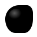

# `value.js` 

CSS value parsing, color theory, and unit conversion. Typed values with units—`deg`, `px`, `rem`, `oklch()`—the CSS value vocabulary.

[demo](https://color.babb.dev) · [color app guide](docs/color-app.md)

## Features

- Parse any CSS value: lengths, angles, times, colors, `calc()`, `var()`, gradients, transforms
- **15 color spaces**: RGB, HSL, HSV, HWB, Lab, LCh, OKLab, OKLCh, XYZ, Kelvin, sRGB-linear, Display P3, Adobe RGB, ProPhoto RGB, Rec. 2020
- Color space conversion via **XYZ hub** with analytical gamut mapping (Ottosson's algorithm)
- **Color quantization**: OKLab-native palette extraction (MMCQ + k-means++) with chroma-weighted clustering and JND deduplication
- CSS Color Level 4 support: `color()`, `color-mix()`, relative color syntax
- CSS math functions: `calc()`, `min()`, `max()`, `clamp()`, trig, exponential
- 30+ easing functions: cubic-bezier, stepped, linear(), bounce, sine, expo
- 2D/3D matrix decomposition with quaternion slerp interpolation
- Normalize, interpolate, and convert between units

## Install

```bash
npm install @mkbabb/value.js
```

## Usage

```ts
import {
    parseCSSValue,
    parseCSSColor,
    ValueUnit,
    FunctionValue,
} from "@mkbabb/value.js";
```

## Build

```bash
npm run build        # library → dist/value.js + value.cjs + value.d.ts
npm run gh-pages     # demo → dist/
npm run dev          # dev server (Vite default port)
npm test             # vitest (1387 tests)
npm run test:e2e     # playwright (desktop + mobile)
```

## Structure

```
src/
├── index.ts              # barrel exports (~200 symbols)
├── math.ts               # lerp, bezier, clamp, scale, deCasteljau
├── easing.ts             # CSS timing functions (cubic-bezier, stepped, linear())
├── utils.ts              # clone, memoize, debounce, RAF, case conversion
├── parsing/              # @mkbabb/parse-that combinators for CSS values
│   ├── index.ts          # parseCSSValue, gradients, transforms, var()
│   ├── units.ts          # length, angle, time, frequency, resolution, flex, %
│   ├── color.ts          # 15 spaces, hex, named, color-mix(), relative syntax
│   ├── math.ts           # calc() AST, min/max/clamp, trig, exp
│   ├── utils.ts          # istring, number, none, tryParse helpers
│   └── grammars/         # BBNF spec grammars (used in equivalence tests)
├── units/                # core value classes + unit definitions
│   ├── index.ts          # ValueUnit, FunctionValue, ValueArray
│   ├── constants.ts      # unit arrays, 630+ CSS property names
│   ├── utils.ts          # unit conversion (px, deg, ms, Hz, dpi)
│   ├── normalize.ts      # value normalization + interpolation setup
│   └── color/            # 15 color spaces, conversion, gamut mapping
│       ├── index.ts      # Color<T> base + space classes
│       ├── constants.ts  # ranges, matrices, white points, named colors
│       ├── matrix.ts     # Vec3/Mat3 (row-major, replaces gl-matrix)
│       ├── utils.ts      # conversions via XYZ, mixColors, gamutMap
│       ├── normalize.ts  # color normalization to [0,1], space conversion
│       ├── gamut.ts      # Ottosson analytical sRGB gamut mapping
│       └── colorFilter.ts # CSS filter solver (SPSA)
├── quantize/             # image color quantization
│   ├── index.ts          # quantizePixels, dominantColor (public API)
│   ├── cluster.ts        # MMCQ median cut, k-means++, JND dedup
│   └── types.ts          # QuantizeOptions, QuantizedColor
└── transform/
    └── decompose.ts      # 2D/3D matrix decomposition, quaternion slerp
```

## Color Spaces

All conversions route through the **XYZ D65** hub, enabling any-to-any conversion. Perceptual spaces (OKLab, Lab) use D50 natively with Bradford chromatic adaptation where needed.

Each color space is documented in [`assets/docs/`](assets/docs/), therein with historical context, component ranges, conversion functions, and practical applications.

### Gamut Mapping

Out-of-gamut colors are mapped using Björn Ottosson's analytical sRGB algorithm: a polynomial initial guess refined by a single Halley's method step (cubic convergence). Significantly faster than CSS Color 4's iterative binary search. Hue is preserved exactly; an adaptive `L0` formula blends between chroma reduction and mid-gray anchoring.

See [`docs/gamut-mapping.md`](docs/gamut-mapping.md) for the full treatment.

### Color Quantization

`quantizePixels()` extracts a perceptual palette from raw image data. The pipeline operates natively in OKLab—MMCQ pre-clustering, k-means++ with chroma-weighted distance, JND deduplication.

```ts
import { quantizePixels, dominantColor } from "@mkbabb/value.js";

const palette = quantizePixels(pixels, width, height, { k: 6 });
const dominant = dominantColor(pixels, width, height);
```

See [`docs/quantization.md`](docs/quantization.md) for the full pipeline.

## Easing

30+ timing functions covering the CSS `<easing-function>` grammar plus bounce and back. `CSSCubicBezier` solves via Newton-Raphson with bisection fallback; `cssLinear()` implements CSS Easing Level 2 piecewise-linear with gap filling per spec; stepped easings support all four jump terms.

## Transforms

CSS `matrix()` and `matrix3d()` decomposition per the CSSOM View and CSS Transforms specs. 3D uses Gram-Schmidt orthogonalization + quaternion extraction. `slerp` for rotation interpolation. `interpolateDecomposed()` for full transform blending.

## Sources, acknowledgements, &c.

- Ottosson, B. (2020). [A perceptual color space for image processing](https://bottosson.github.io/posts/oklab/). — OKLab: the perceptual color space used for `color-mix()` and gamut mapping.
- Ottosson, B. (2021). [sRGB gamut clipping](https://bottosson.github.io/posts/gamutclipping/). — Analytical gamut mapping algorithm (cubic boundary + Halley's method).
- Atkins Jr., T., Lilley, C., & Verou, L. (2025). [CSS Color Module Level 4](https://www.w3.org/TR/css-color-4/). W3C CRD. — The spec governing all CSS color functions.
- [CSS Filter Effects Module Level 1](https://www.w3.org/TR/filter-effects/#feColorMatrixElement). W3C. — `feColorMatrix`; basis for the CSS filter solver.
- Lindbloom, B. [XYZ to Correlated Color Temperature](http://www.brucelindbloom.com/index.html?Eqn_XYZ_to_T.html). — CCT conversion reference.
- [`@mkbabb/parse-that`](https://github.com/mkbabb/parse-that) — Parser combinators powering the CSS value grammar.

See [`docs/color-theory.md`](docs/color-theory.md) for the full bibliography.
