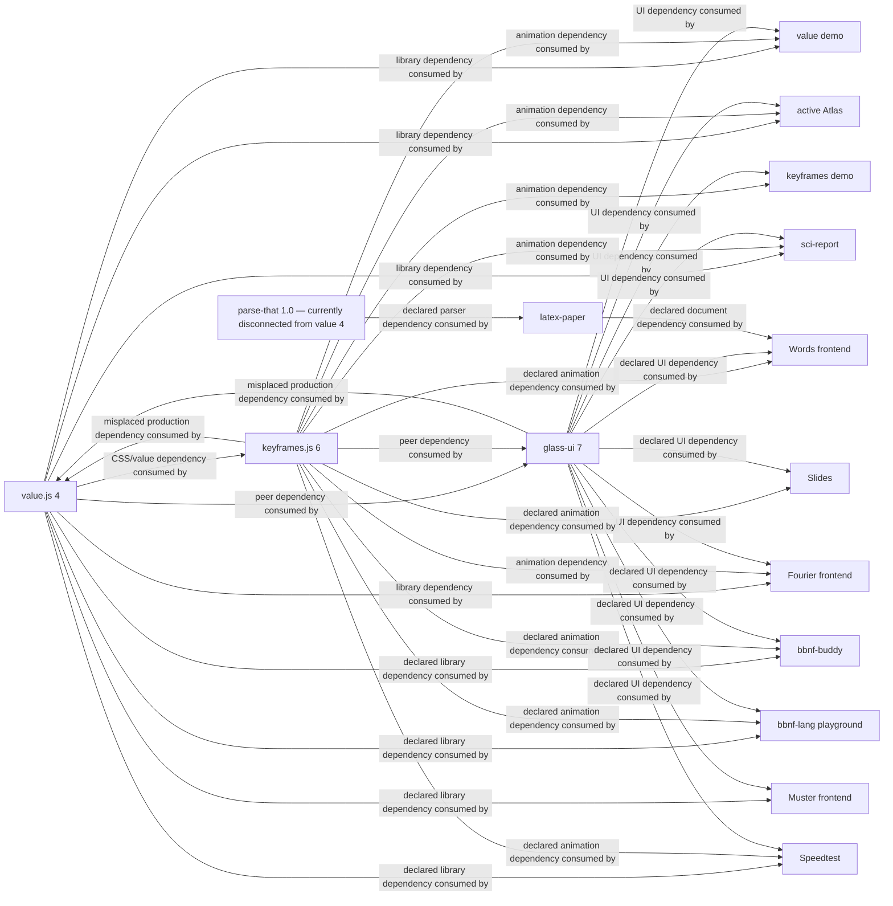

# Current DAGs

## Arrow convention

Every DAG uses `DEPENDENCY OR PRODUCER --> CONSUMER`. An arrow `A --> B`
means “B requires or consumes A”; it never means “A imports B.” Every rendered
edge names what the consumer receives.

## Package graph



The current invalid cycles are explicit: keyframes and glass are mistakenly
production dependencies of value while each also consumes value through its
proper consumer or peer role. The value library must not production-depend on
its demo renderer or animation consumer.

## Static graph census

The census is regenerated by
[`tools/module-graph.mjs`](tools/module-graph.mjs), schema
`vnext-module-graph/3`. The tool refuses a missing, invalid or non-HEAD `--ref`
instead of printing a decorative pin, and hashes the exact included working
files so a dirty-source graph remains reproducible without pretending to be a
commit graph. Current tool SHA-256:
`25dc5cd78b5bc18941ba90fbadaa1126e84052429cf0bb75c020afd92a1899c3`.
It parses TypeScript/JavaScript/Vue imports and exports, distinguishes type from
runtime records, resolves source `.js` specifiers to TypeScript, emits every
node/edge/package/unresolved record, and computes runtime and combined Tarjan
SCCs. The artifact hash covers the compact canonical body; the pretty JSON is
the inspectable projection.

| Working graph | Verified HEAD | Working-input SHA-256 | Nodes | Import/export records | Unique file edges | Runtime SCCs | Type-inclusive SCCs | Artifact SHA-256 |
|---|---|---|---:|---:|---:|---:|---:|---|
| value library `src` | `c654824e0b252cda7f8490b67f182a48c48cc0ed` | `643892b8acd0368b2f16cd241c365992172b25142e1c57a738655d2ebcdeae6a` | 26 | 58 | 44 | 0 | 0 | `887a19f99656525d347c21d0423eabb9d4a61aa040edce66b792a43a7f3f1c4a` |
| value demo `demo` | same | `e4c3507508b415dddfce2c23e816b8ba853000e4db088a404cca2171a046db6d` | 250 | 683 | 655 | 1 | 4 | `08b18535e50ae11c982350f098fa98eb680e69b9383fea5af2b3e23e8e82db5f` |
| value `/api` `api/src` | same | `351d2a0c734108ac995b282de7813d50f40ec5a69f4e3a9c247421106ef6924b` | 111 | 354 | 348 | 0 | 0 | `e1149500e31eee6f01057c3a509368413574dbed4e93ae1c5de22b4d5bf32a62` |
| keyframes library `src` | `81a56990736ced5b5edde0b84c527680ac7689b1` | `153daa206fdb1cbba3dd3d27d375e9d82eec2ed7fd7f377ada9a971887f38d77` | 153 | 627 | 522 | 0 | 4 | `dbc28b90983c6f7f87306d04fbab6e05c34bacee54fb46f7189c23b6c2941a21` |
| keyframes demo `demo` | same | `30c692a2e2daca68deb405e69980ceb73ff055b4b267a48001c65f3a531d1d20` | 185 | 258 | 245 | 1 | 3 | `4e90028bb374228dee4608fcfdbb072ff80f0868a5f056a21c2d674ccc687972` |

All five runs resolve every relative import. External-relative and package
edges remain in the artifact rather than being folded into internal counts.
These are working-source graphs, not tagged-source or packed-export claims;
V00A/K00/M00 must produce those distinct truths before any transpose.

### Exact live SCC clusters

- Value demo runtime: `demo/shell/dock/Dock.vue ↔ demo/shell/dock/index.ts`.
- Value demo type-inclusive: the runtime dock pair; the seven-node palette
  admin/use-port cluster; the About Markdown component/index pair; and the
  three-node Gradient parse/model/CSS composable cluster.
- Keyframes library type-inclusive: four nodes around compile value AST and
  constants; fifteen nodes around engine/resolve/WAAPI; five group/lifecycle
  nodes; and the two sequence lifecycle nodes. There is no runtime SCC.
- Keyframes demo runtime: five orbital-drag component/composable/index nodes.
  Type-inclusive review adds the easing key/demo pair and the four spring
  key/editor/demo nodes.

The full member lists are emitted by the commands below; cluster labels never
replace edge evidence.

```sh
node docs/tranches/V/vnext/tools/module-graph.mjs --repo /Users/mkbabb/Programming/value.js --include src --label value-library --ref c654824e0b252cda7f8490b67f182a48c48cc0ed
node docs/tranches/V/vnext/tools/module-graph.mjs --repo /Users/mkbabb/Programming/value.js --include demo --label value-demo --ref c654824e0b252cda7f8490b67f182a48c48cc0ed
node docs/tranches/V/vnext/tools/module-graph.mjs --repo /Users/mkbabb/Programming/value.js --include api/src --label value-api --ref c654824e0b252cda7f8490b67f182a48c48cc0ed
node /Users/mkbabb/Programming/value.js/docs/tranches/V/vnext/tools/module-graph.mjs --repo /Users/mkbabb/Programming/keyframes-v-exec --include src --label keyframes-library --ref 81a56990736ced5b5edde0b84c527680ac7689b1
node /Users/mkbabb/Programming/value.js/docs/tranches/V/vnext/tools/module-graph.mjs --repo /Users/mkbabb/Programming/keyframes-v-exec --include demo --label keyframes-demo --ref 81a56990736ced5b5edde0b84c527680ac7689b1
```

## Structural evidence

### Value library

- `css/stylesheet.ts` is approximately 899 lines.
- `transform/decompose.ts` is approximately 609 lines.
- `transform/path.ts` is approximately 564 lines.
- `css/grammar.ts` is approximately 483 lines.
- `subpaths/` is an export-home layer rather than domain ownership.
- Tests and demo tests do not yet form one complete external isomorphic mapping.
- The working manifest places glass/keyframes in production dependencies.

### Keyframes library

Large current files include animation, compiler, entry, draggable, CSSOM and spring/progress modules. The tree is nested as deeply as five levels in places. Exact graph normalization proved that removing the redundant `src/animation/` prefix preserves import topology, but graph equivalence alone does not prove the move’s architectural worth.

### Value API

The graph is acyclic but contains severe contract defects:

- public slug-only login can mint sessions;
- visibility checks are bypassed by detail/version/fork reads;
- content hash is used as global revision identity;
- ETag omits mutable representation fields;
- delete paths disagree between soft and hard deletion;
- restore/history/diff facilities are incomplete or removed;
- votes toggle and are unsafe under retry;
- admin commands and audit ownership drift;
- tests are colocated under source modules.

### Fourier API

Current evidence includes:

- an approximately 889-line visualization router;
- incomplete frontend client coverage;
- content-hash/history defects similar to value’s;
- cosmetic filters and GET-side view mutation;
- private provenance leakage risk;
- insecure slug-login/session ownership;
- orphan derivation/remix/diff types;
- API tests under the API tree rather than the target external isomorphic tree.

## Parser graph

Parse-that currently exposes root, core, diagnostics, packrat and utils entrypoints. Static imports from the parser core reach diagnostic/debug code, so the current `./core` package claim is not yet proven by the actual bundle graph.

The parser retains:

- public mutable `Parser.state`;
- module-global diagnostic enablement/collection;
- module-global packrat epochs;
- mutable zero-copy span state;
- custom scanner leaves.

Value’s current CSS parser is a regex/character-split rewrite with no retained benchmark corpus. Keyframes itself is correctly parser-less apart from a duplicated light-engine timing-name table requiring explicit ratification or consumption.

## Demo evidence

### Value

- mobile action tools are difficult to discover;
- `/blob` selects the wrong default pane;
- Gradient specimens overflow compact widths;
- Atmosphere is a long generic slider wall;
- Blob exposes an overwhelming parameter field;
- route transitions can show clipped semantic content;
- Browse exhibits placeholder/black-band defects;
- admin pages contain excessive dead space;
- touch seats are frequently smaller than the desired seat.

### Keyframes

- the mobile controls sheet contains unreachable content;
- hidden Monaco instances create surfaces near 16.7 million pixels;
- Easing chips overflow;
- Spring controls extend below the viewport;
- Sequence controls become tiny;
- Amiga can appear blank before readiness;
- Cube lacks complete two-pointer quaternion interaction;
- mobile navigation does not adequately expose the scene set.
