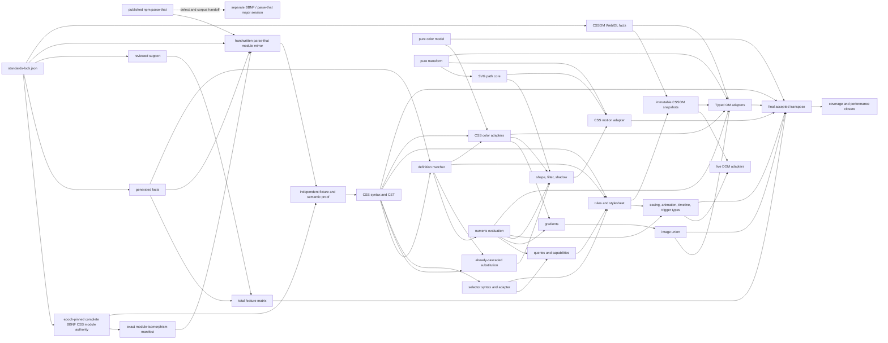

# Parser, CSS, and Color Program

## Charter

This program establishes one acyclic parser and CSS spine:

1. Published `@mkbabb/parse-that@1.0.0` supplies the immutable
   parser-combinator substrate for the full-CSS prototype. This tranche never
   alters or republishes it.
2. Major parse-that architecture, new combinator families, Tape/SoA, and BBNF
   host/emitter work are routed to a separate BBNF/parse-that session.
3. `value.js` owns lossless CSS syntax, typed values, context-free evaluation, explicit-context resolution, browser delegation, and honest refusal.
4. `keyframes.js` consumes `value.js` animation values; it does not create a second CSS parser or property semantics engine.

No project migration alias, compatibility shim, dual parser, hidden fallback,
or report-only implementation wave may land. Standards-mandated parse-time
compatibility is different: each such spelling is a pinned
`standards_compat_alias` fact, exact serialization preserves the authored
spelling, type/lower applies the specification's canonicalization, and
canonical serialization emits the canonical spelling. This tranche does not
perform the clean-breaking parse-that reset: optional or novel changes route
to the BBNF/parse-that handoff. C10 leaves 1.0.0 unchanged and unpublished.
Any substrate blocker is banked, routed to the active campaign, and prevents
V-next adoption until a separately authorized future epoch resolves it.
The active campaign's `PT-0.W0` is presently an isolated fail-closed
pin/content harness and remains RED until its own quiescent two-census
capture. Its older P/A/G/I/S parse families are engine assays only: no
parse-only artifact earns product credit or enters Value. A later engine organ
can be considered only when it is independently reimplemented inside a
complete VT vertical with every then-current PT/BB lock, a full typed value
API, exhaustive JSON and CSS-L4 evidence, and exact BBNF-authored types. Those
conditions do not relax P00/P01's fresh terminal-union resnapshot law.

The 2026-07-18 coordination checkpoint reports a four-of-four complete-
vertical portfolio under the upstream campaign's unchanged locks: staged /
compact tape, independently verified / schema-row, persistent incremental /
rope, and GLL-SPPF / eager arena. This is coordination state only, not Value
design authority, implementation evidence, or product credit. `PT-0.W0`
remains deliberately RED and does not freeze or recapture Value while V-next
formation moves. Graph P3.1 resource twins are measured green, but semantic
movement remains denied; CSS/JSON remain isolated assays with zero candidate
or product credit. Before P00/P01 may author CSS, the upstream task must
provide and reconcile the then-current **published** parse-that tip and
artifact digest; P00 then refreshes its V2 snapshot from that public truth.
After the boundary is stable, Value returns only the exact HEAD/tree/receipt
identity as upstream consumer evidence, never authority. No T/U prototype,
banked `docs/tranches/B` proposal, or private source may bridge the wait.

## Binding laws

- P00 pins the exact published runtime, declarations, exports, artifacts, and
  consumers before the prototype selects any usage pattern.
- The full-CSS prototype uses only root-exported, declaration-backed parse-that
  entrypoints, including public `ParserState` diagnostics. It may not call the
  raw `.parser` function, use private paths/workspace links, or require
  process-global cleanup as a workaround.
- A pinned CSS-prototype witness may prove a parse-that blocker, but it cannot
  authorize a local parse-that change. P02 classifies and routes it; Value
  remains on the exact published 1.0.0 receipt or refuses adoption.
- An upstream pin/content harness, parse-family assay, or partial parser is
  observation only. It cannot satisfy P00, authorize a P01 input, or be copied
  into Value even when its local probes are green.
- Runtime values and public TypeScript declarations must agree on every
  parse-that operation the prototype exercises.
- Package representation, entrypoint redesign, new result models, new
  combinators, Tape/SoA, and Pratt work are outside V-next.
- The TypeScript CSS parser operates on the original JavaScript string with
  branded `OriginalCodeUnitOffset` and `ProcessedCodeUnitOffset` half-open
  boundaries. `Utf8ByteOffset` and `GrammarByteOffset` are distinct domains
  that cannot substitute for code-unit offsets.
- CSS preprocessing records a monotone processed-to-original source map.
- One scanner emits tokens and may optionally record evidence. Recording cannot create a second scanner.
- P01 does not invent a second grammar topology. P00 first waits for the active
  BBNF campaign's terminal full-CSS union freeze, then emits the distinct
  `test/proof/p00/css-module-isomorphism.execution.json`. Its runtime modules,
  non-runtime dispositions and resolved import edges must equal the upstream
  freeze's three authoritative vectors byte-for-byte. Every runtime BBNF file
  has one exact handwritten `src/css/grammar/<relative-stem>.ts` peer using only
  public parse-that combinators and one external isomorphic test. The checked-in
  [`CSS-MODULE-ISOMORPHISM.json`](CSS-MODULE-ISOMORPHISM.json) remains an
  immutable formation-current receipt; it is neither regenerated in place nor
  an execution ceiling. Formation may expose an upstream edge defect;
  execution requires a zero-correction canonical BBNF DAG. A future generated
  parser may replace the handwritten implementation after separate
  adjudication; it never runs beside it.
- Generated registries contain mechanical facts only. A separately reviewed
  support manifest owns operation-level dispositions, and their total keyed
  join is the consumer capability matrix. Handwritten semantics remain in
  named domain waves.
- Unknown or unimplemented syntax is preserved, delegated, or explicitly refused. Preservation is not typed support.
- Value owns experimental `spring()` grammar behind the support flag; unflagged
  parsing refuses it. Keyframes alone owns the solver, and stable CSS emission
  remains bounded standard `linear()` samples.
- The 2026-07-15 CSS Color 4 ED permits Local-MINDE, EdgeSeeker, or Ray Trace
  and requires the selected gamut-mapping algorithm to be used consistently.
  V15 selects Local-MINDE as the one production CSS policy, uses Ray Trace only
  as a test-side exact-boundary oracle, and marks EdgeSeeker
  `refused-at-evaluate` while its pseudocode is incomplete. V15P restores one
  shared cusp/Halley kernel under a non-CSS name for OKHSL/OKHSV; it never
  carries a `css-*` conformance name. Browser strings are not the used-value
  oracle.

## C14 formation assay

[`prototypes/c14-css/`](prototypes/c14-css/README.md) is the executed isolated
assay required during formation. Its 49 retained files total 64,760 bytes; the
external all-file canonical ledger is
`960229bf2af2bbe6a725ebbcab066cc3146bd2d25082730f76afa4d57624a13e`.
The on-disk acyclic corpus receipt binds its other 48 files/64,517 bytes at
`66649243ef6fee870cb9e1d6d024abba19cb0d1bd967e459d8012ccb926c3d5c`.
It installs exactly `@mkbabb/parse-that@1.0.0` (tarball SHA-256
`d270d89a435451f4c460e0134c7a508524efc02fd40f2b20b74e54c77d203eef`),
mirrors all 15 formation-current BBNF stems with 15 handwritten TypeScript
filename/import-topology peers and 15 external tests; full semantic equivalence
remains P01 RED. Typecheck, byte-twinned package receipt, topology proof and
17/17 external tests pass. Its product-shaped W0 covers `oklch()`,
`cubic-bezier()`, and one qualified stylesheet rule with typed lowering,
structured diagnostics, full consumption, a validated token/trivia partition,
exact untouched serialization and safe-integer in-root bounded edits.

This is assay credit only. Its pinned arm64 environment records 11×1000 samples
at a 16.596708 ms median after a semantic-result preflight, while current and historical comparison adapters are
honestly absent and earn zero comparative credit. P00's fresh coordinated
topology, P01's complete equivalence, full CSS/CSSOM/WAAPI coverage and
production integration remain born RED. No prototype byte mutates Value
production or parse-that source.

## CSS operation-vector algebra

A scalar “terminal stage” is forbidden: the same feature may parse and type,
serialize authored syntax, refuse context-free evaluation, and delegate
resolution. Every feature therefore owns the following total vector:

```ts
type OperationState =
    | { kind: "implemented"; evidence: string }
    | { kind: "delegated"; capability: string; evidence: string }
    | { kind: "preserved_syntax_only"; evidence: string }
    | { kind: "refused"; code: string; evidence: string }
    | { kind: "not_applicable"; reason: string };

interface FeatureOperations {
    parse: OperationState;
    type: OperationState;
    evaluate: OperationState;
    resolve: OperationState;
    adapt: OperationState;
    serialize: {
        exact: OperationState;
        edit: OperationState;
        canonical: OperationState;
    };
}
```

`preserved_syntax_only` can green only parse/exact/edit cells. Delegation is a
strategy for resolve/adapt, not a stage. Refusal is an outcome at the operation
that cannot proceed. Maturity (`stable | experimental | at_risk | obsolete`),
spec category, and browser interop are independent axes. “Full coverage” means
the standards-fact inventory and reviewed support manifest form a total,
unambiguous composite-key join; it does not mean the library pretends to own
layout, cascade, resource fetching, live DOM, or display color management.

The three serializers are distinct:

- **Exact:** untouched input satisfies `serializeExact(cst) === originalString`.
  Byte identity is claimed only when original bytes and their decoding policy
  are separately retained. Returning a retained root source without proving
  token/trivia/recovery coverage is a vacuous failure.
- **Edit-preserving:** edited nodes change while unaffected source and trivia
  remain intact. Stable node IDs identify edits; edit ranges are typed,
  nonoverlapping and conflict-refusing.
- **Canonical:** semantic values receive normalized serialization without claiming source fidelity.

V03 materializes `SourceText { original, processed, boundaryMap }`.
`boundaryMap` has `processed.length + 1` entries and defines both left- and
right-biased original UTF-16 boundaries through CRLF collapse, CR/FF/NUL
replacement, lone surrogates, astral code points and escapes. Checked branded
constructors prevent original UTF-16, processed UTF-16, UTF-8 byte and grammar
byte offsets from mixing. Tokens, trivia and recovery intervals partition the
processed input; no gap can be hidden by exact serialization.

## Target architecture DAG



Arrows point from producer to consumer, not from importer to dependency. In
source, consumers may import producers; pure domains never import CSSOM,
browser state, demos or `keyframes.js`. There is no substitution→selector,
image→transform, or path↔shape/motion SCC. Exact edges remain constraints until
V29T regenerates the accepted source graph; no unmeasured target node count is
canonical.

## Target trees

### External parse-that major-session hypothesis

The following tree is retained only as a question packet for the separate
BBNF/parse-that session. V-next neither selects nor implements it.

```text
typescript/
  src/
    parse/
      core/
        parser.ts
        state.ts
        session.ts
        lifecycle.ts
        error.ts
        types.ts
      combinator/
        choice.ts
        sequence.ts
        repeat.ts
        transform.ts
        assertion.ts
        recovery.ts
      leaf/
        literal.ts
        regex.ts
        dispatch.ts
        whitespace.ts
      diagnostic/
        context.ts
        line-map.ts
        format.ts
        index.ts
      memo/
        epoch.ts
        cell.ts
        grow.ts
        index.ts
      grammar/
        json.ts
        csv.ts
        string.ts
        number.ts
        index.ts
      entry/
        core.ts
        diagnostics.ts
        packrat.ts
        utils.ts
        index.ts
  test/
    parse/
      core/
      combinator/
      leaf/
      diagnostic/
      memo/
      grammar/
      entry/
```

Tests remain external and isomorphic. Grouped filenames omit their enclosing module name.

### P01 BBNF authority and handwritten combinator mirror

Formation consumes, but does not modify, the exact committed CSS L4 module set
at BBNF HEAD `af15f63e0d2d3d719938c13b906a50acbb92ea3b`. The following is the
current 15-file formation snapshot, not a newly proposed 28-file tree and not
an execution ceiling:

```text
grammar/css/l4/                 src/css/grammar/l4/
  color.bbnf                      color.ts
  easing.bbnf                     easing.ts
  filters.bbnf                    filters.ts
  func-body.bbnf                  func-body.ts
  gradients.bbnf                  gradients.ts
  keyframes.bbnf                  keyframes.ts
  keywords.bbnf                   keywords.ts
  media.bbnf                      media.ts
  properties.bbnf                 properties.ts
  selectors.bbnf                  selectors.ts
  stylesheet.bbnf                 stylesheet.ts
  tokens.bbnf                     tokens.ts
  transforms.bbnf                 transforms.ts
  value-unit.bbnf                 value-unit.ts
  values.bbnf                     values.ts
```

The filename join is exact and total. Each TypeScript peer owns the same
grammar responsibility and is handwritten with published parse-that 1.0.0
combinators. The formation snapshot records one upstream topology defect:
`stylesheet.bbnf` repeats keyframe productions instead of importing canonical
`keyframes.bbnf`. The active BBNF CSS-generator tranche owns that repair; P01
cannot start until the full-union execution manifest has zero corrections and
`stylesheet.ts` can mirror the corrected BBNF import exactly.
`grammar/css/pretty.bbnf` is outside the L4 runtime
vector and supplies serialization/recovery fixtures only; it can never become
a second parser. The mapped TypeScript graph must contain zero SCCs.

The active SK-V25 campaign has notified Value that its terminal CSS target is
a larger full modular union covering the Snapshot 2026 constituents,
exceptions, every W3C Level-4 module, CSS Syntax and normative dependencies.
Its 2026-07-18 restart checkpoint currently assays 84 specifications at CSSWG
`c7573530343759ace8e46438a1fa2c44515b5554`, 10,454,319 exact source bytes,
690 structured property/descriptor rows and 512 named production splits. Those
numbers are RED observations, not authority: dated pins after W3C 429, five
legacy/foundation carriers, railroad/RHS/reference/WPT/semantic closure and
hostile review remain open. BB-JSON Family A is retired as an
`INCOMPLETE_ASSAY`; its blocked Family D cannot supply Value types or values.
The union is not yet frozen and its T/U evidence remains isolated. Therefore
P01 cannot execute from the 15-file formation snapshot. After the active
campaign closes, P00 appends a fresh coordination snapshot, verifies the
upstream parser/resolver-produced runtime, exclusion and resolved-edge vector
hashes, and writes the distinct execution artifact
`test/proof/p00/css-module-isomorphism.execution.json` from every CSS grammar
file extant at that exact pin. P01 consumes those bytes without reclassifying a
module or reparsing execution imports with a Value-owned regular expression.
Every runtime stem receives one TypeScript combinator peer and one external
isomorphic test; zero files may be retained from or omitted because of the
earlier cardinality. If P00 returned before that terminal freeze, P00 reopens
and re-returns; a current-snapshot receipt cannot be promoted in place.

[`CSS-MODULE-ISOMORPHISM.json`](CSS-MODULE-ISOMORPHISM.json), its strict schema
and `tools/validate-css-module-isomorphism.mjs` are the formation-current
receipt and common validator. Formation validation may diagnose the incumbent
files and known edge defect; execution validation trusts no ad-hoc import
regex. It joins the execution artifact to the upstream freeze's exact runtime,
non-runtime and canonical resolved-edge hashes, enumerates the pinned committed
tree, verifies every source byte, proves the filename/test join, requires zero
corrections and rejects cycles. With proposal roots it additionally rejects any
undeclared runtime or test artifact and proves the TypeScript graph and test
imports exactly. Any BBNF byte or topology drift requires a new append-only
coordination epoch and new execution artifact; it is never absorbed silently or
written over the formation receipt. The historical BBNF host capsule is now
byte-preserved as evidence only; it is neither topology authority nor an
alternate runtime.

The independent P01 work split is implementation-versus-oracle, not two
competing grammar designs. One author implements the exact TypeScript mirror;
the other derives CST, malformed-input, span and serialization fixtures from
the pinned BBNF responsibilities and standards corpus without reading that
implementation. Neither invents, flattens, or renames modules.
The former formation-scale P01 authorship manifest is evidence-only apparatus.
P01 remains born RED until P00/V01/V02 return and the ordinary wave-level
two-skeptic/one-adjudicator method can challenge one real implementation.

After all three predecessors return terminally, P01 freezes one
`vnext-p01-input-epoch/1` that binds their universal returns, the exact CSS
corpus, standards lock, value CSS signatures, stable host capsule, the absolute
path and both file/internal hashes of P00's distinct execution manifest, the
published-package receipt, typed origin ledger, coordinating Codex session,
and the latest P00 append-only coordination tip whose parse-that/BBNF pins pass
`validate-pt-coordination --require-current`.
The coordinator then spawns exactly
two Sol-ultra sibling authors with `fork_turns:none` and zero inherited
dialogue. Their ancestry contains exactly self plus that named coordinator;
neither author can descend from the other, and no further common ancestor is
legal. Canonical child and coordinator JSONLs jointly prove spawn IDs, agent
paths/slots, requested and served model/effort, isolation directives, and the
same frozen epoch. Each author freezes a disjoint proposal root, report,
access-log/read-set and artifact-tree hash before peer access. A third distinct
Sol-ultra P01 adjudicator receives the immutable path and file hash of each
typed proposal manifest, plus both frozen receipt hashes, only after both
freeze times and returns the total fixture/implementation differential ledger.
Missing, self-asserted-only, reused, ancestrally contaminated, peer-read, stale
or unexecuted input is RED. Same-session, fixture-from-implementation,
implementation-from-fixture, or post-comparison rewriting is RED. The access proof is deliberately bounded: Codex JSONL exposes
recorded tool calls, tool outputs, file/MCP reads, exec arguments, follow-ups and messages,
not operating-system reads outside those calls. The enforceable independence
boundary is therefore `fork_turns:none`, zero inherited dialogue, disjoint
undisclosed roots, overlapping author sessions, both freezes before any
recorded peer-root disclosure, and a transcript-derived canonical access
projection—not a false claim of exhaustive filesystem observation. The active
BBNF major session retains sole authority over host, emitter, module, Tape/SoA,
Pratt and package-topology changes.

### `value.js`

```text
src/
  foundation/
    result.ts
    span.ts
    context.ts
    number.ts
  color/
    model.ts
    space.ts
    whitepoint.ts
    adapt.ts
    convert.ts
    difference.ts
    gamut.ts
    interpolate.ts
    mix.ts
    ramp.ts
    into.ts
    profile.ts
    hdr.ts
    okhsl.ts
    okhsv.ts
  easing/
    linear.ts
    steps.ts
    bezier.ts
  image/
    model.ts
    gradient.ts
    cross-fade.ts
    resource.ts
  transform/
    model.ts
    matrix.ts
    interpolate.ts
  path/
    syntax.ts
    curve.ts
    length.ts
  geometry/
    shape.ts
  css/
    syntax/
      preprocess.ts
      source.ts
      token.ts
      cst.ts
      recover.ts
      serialize.ts
    grammar/
      l4/
        color.ts
        easing.ts
        filters.ts
        func-body.ts
        gradients.ts
        keyframes.ts
        keywords.ts
        media.ts
        properties.ts
        selectors.ts
        stylesheet.ts
        tokens.ts
        transforms.ts
        value-unit.ts
        values.ts
    definition/
      parser.ts
      matcher.ts
      compiler.ts
    registry/
      schema.ts
      facts.ts
      support.ts
      matrix.ts
    value/
      numeric.ts
      unit.ts
      math.ts
      substitution.ts
      resolve.ts
    color/
      parse.ts
      lower.ts
      serialize.ts
    image/
      parse.ts
      lower.ts
    gradient/
      parse.ts
      lower.ts
    effect/
      filter.ts
      shadow.ts
    transform/
      parse.ts
      lower.ts
      serialize.ts
    motion/
      parse.ts
      lower.ts
      serialize.ts
    selector/
      parse.ts
      specificity.ts
      nesting.ts
    query/
      media.ts
      container.ts
      supports.ts
    rule/
      declaration.ts
      model.ts
      stylesheet.ts
    animation/
      easing.ts
      keyframes.ts
      model.ts
      timeline.ts
      range.ts
      trigger.ts
    om/
      idl.ts
      snapshot.ts
      text.ts
      dom.ts
      typed.ts
      refusal.ts
  index.ts
test/
  src/
    foundation/
    color/
    easing/
    image/
    transform/
    path/
    geometry/
    css/
      syntax/
      grammar/
        l4/
      definition/
      registry/
      value/
      color/
      image/
      gradient/
      effect/
      transform/
      motion/
      selector/
      query/
      rule/
      animation/
      om/
```

`grammar/l4/tokens.ts` is the sole lexical owner in the current snapshot. Its importing peers use the
spanned public combinators and continue on the same original string/parser
state; there is no encoded token buffer, imaginary `TokenCursor`, regex
rescan, or second scanner. `syntax/` owns shared source, token/CST data,
recovery and serialization types rather than a competing grammar. P01 builds
this tree adoption-free under its frozen proposal root; V03 transposes the
adjudicated bytes into production instead of rewriting them.

The displayed fifteen `grammar/l4` leaves are the current formation snapshot.
At P01 execution, “all peers” means every module in the newly coordinated BBNF
full-union manifest; the tree and its external test isomorph are regenerated
from that manifest before implementation begins. The lexical-owner statement
is re-adjudicated if the terminal BBNF topology names more than one lexical
module rather than being forced onto an obsolete count.

There is no `src/subpaths`, `internal`, demo import, keyframes import, or runtime
`glass-ui` edge. The unchanged root and exactly seven public keys survive:
`./color`, `./css`, `./easing`, `./math`, `./path`, `./transform`, and `./value`.
Only `./quantize` is tombstoned. V24P publishes from `./path`, never through
`./transform` or a forwarding module.

The target is exact, not a branch family. V15P restores the shared non-CSS
cusp/Halley kernel; V18H and V18V retain `okhsl.ts` and `okhsv.ts` as its two
independently evidenced clients. D-9 prunes `decompose.ts` at the boundary, and
D-19 keeps SoA banked, so no `bulk.ts` target exists. V29T proves the external
test tree is isomorphic to this decided topology. Grouped filenames omit the
enclosing module name; no forwarding file survives a move.

## Color contract

- CSS Color 4 stable syntax and semantics are distinct from Color 5 and experimental inventory.
- Author text is retained independently from canonical typed bytes.
- Conversions state white point, adaptation, alpha, premultiplication, hue, and out-of-range behavior.
- CSS gamut mapping has one explicitly selected production policy, used by
  every CSS-mandated call site. Local-MINDE and Ray Trace are independently
  verified candidates under the pinned ED; EdgeSeeker is refused at evaluate
  while its algorithm remains editorially incomplete.
- Cusp/Halley is an independently adjudicated non-CSS policy and cannot
  masquerade as CSS conformance.
- DeltaE OK, 2000, and ITP publish independent numeric contracts.
- Zero-allocation claims apply only to named, warmed numeric kernels with caller-owned output.
- Parser, diagnostics, DOM adapters, profiles, and UI paths carry no blanket zero-allocation claim.
- HDR and profile-dependent behavior requires explicit capabilities; absent display/profile resources produce typed refusal.
- Interpolation, premultiplication, hue fix-up, gradients, `color-mix()`, and N-stop ramps share one semantic implementation.
- OKHSL and OKHSV are independently adjudicated non-CSS facilities. Consumer count cannot decide their worth.

## Conformance evidence

The pinned manifest records exact digests for:

- CSS Snapshot 2026;
- selected CSSWG editor’s drafts as of 2026-07-18;
- Webref IDL and CSS extracts;
- relevant WPT revisions;
- independent parser fixtures;
- supported runtime and browser versions.

Every feature row contains the total operation vector defined above. Each cell
is implemented with evidence, delegated through a named capability, preserved
for syntax-only operations, refused with a stable code, or not applicable with
a reason. No scalar terminal status replaces those cells.
