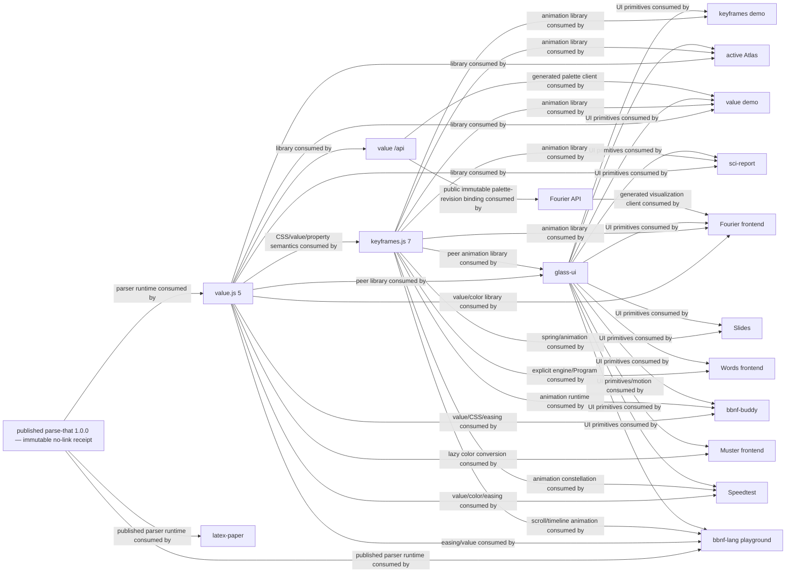
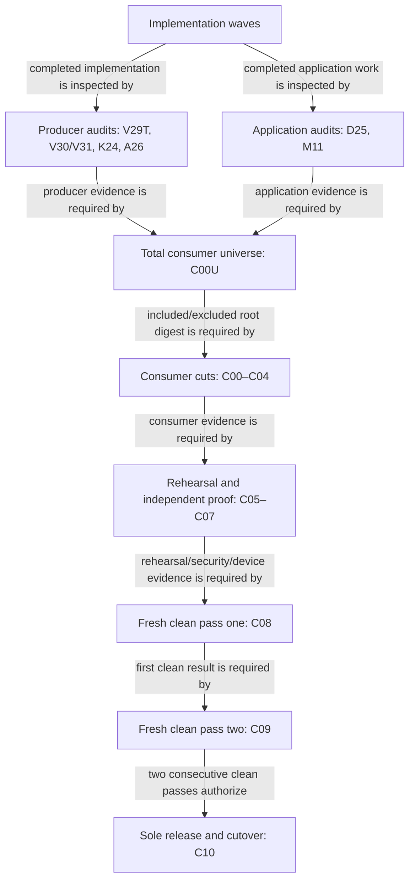

# Target DAGs

## Arrow convention

Every DAG uses `DEPENDENCY OR PRODUCER --> CONSUMER`. An arrow `A --> B`
means “B requires or consumes A”; it never means “A imports B.” Every rendered
edge names what the consumer receives.

The sole machine status authority is
[`WAVE-EDGE-POLICY.json`](WAVE-EDGE-POLICY.json). Every wave-contract hash binds
its outcome class, exact incoming edge policies and that manifest's self-hash.
Its 797-edge expansion is closed: 758 `COMPLETE` predecessors, 29 KEEP-only
edges and ten PRUNE-only edges.
No static edge admits `REFUSED`, `BLOCKED` or `NOT_CLEAN`; `REFUSED` exists only
as a non-advancing typed reopening-supersession result.

## Package DAG



The pinned Words manifest and direct import census prove only keyframes and
Glass edges; therefore no value→Words target edge is invented. C02W owns both
proved edges. C02S owns all three declared Speedtest V/K/G edges even though
its feature casualty is concentrated in keyframes.

There is no value-to-keyframes reverse production edge, no value-to-glass
production edge, and no keyframes server node. The glass-to-value/keyframes
relationships are peer/consumer relationships.

## Semantic ownership

| Domain | Sole owner | Consumers |
|---|---|---|
| Published parser runtime/combinators | parse-that | value full-CSS prototype and production parser |
| Major parse-that/BBNF research | separate PT-E/BBNF session | no V-next runtime consumer without a new owner return |
| CSS syntax/property/value semantics | value.js | keyframes, demos, consumers |
| Color/image/transform/easing semantics | value.js | keyframes, demos, consumers |
| Animation program/plans/runtime | keyframes.js | demos, glass, Atlas |
| Palette API | value.js `/api` | value demo, Fourier binding |
| Visualization API | Fourier Python API | Fourier frontend |
| Interaction primitives/Breath grammar | glass-ui | value/keyframes/Fourier demos and included UI consumers |
| URL state | each application | its routes only |

## Source/test targets

V00A produces five independently hashed truths rather than one hand-authored
graph: tagged source, working source, packed exports, API-by-name semantics and
consumer census. V00C records topology constraints without moving feature
clusters. [`VALUE-TARGET-PATHS.json`](VALUE-TARGET-PATHS.json), manifest
SHA-256 `a83a5218995520e7cff4443d52ba47197fbe780e9b4de4680a93790ea7982d51`,
is the sole expanded exact path authority for the library tree in
[`PARSER-CSS-COLOR.md`](PARSER-CSS-COLOR.md) and the value-demo tree in
[`DEMO-TARGET-DAGS.md`](DEMO-TARGET-DAGS.md). It fixes 103 library source/test
pairs with zero conditional rows: V16B is banked, V18H and V18V are retained,
V24 is pruned, seven package keys survive and only `./quantize` is tombstoned.
Its 146 demo source leaves map to 144 exact external test leaves plus the A20
generated-client and D13 worker-entry exceptions.

```text
value src/<domain>/...        ↔ test/src/<domain>/...
value demo/features/...       ↔ test/demo/features/...
value api/src/modules/...     ↔ api/test/src/modules/...

keyframes src/<domain>/...    ↔ test/src/<domain>/...
keyframes demo/features/...   ↔ test/demo/features/...

fourier api/modules/...       ↔ tests/api/modules/...
```

Generated corpora, fixtures, browser harnesses and test-support utilities use named exceptions. There are no `__tests__` directories inside source.

The exhaustive Glass/value-demo target trees, route packets and import/render/
state/API/capability/focus/scroll edge laws live in
[`DEMO-TARGET-DAGS.md`](DEMO-TARGET-DAGS.md). They are canonical; a generic
`features/shared/components` sketch is not.

The standards evidence graph is likewise explicit:

```text
standards-lock.json → registry-facts.generated.json ─┐
                                                     ├→ feature-matrix.json
terminal wave receipts → support-manifest.reviewed.json ┘

feature-matrix.json + accepted terminal decisions → V29T transpose
V29T packed graph + semantic capability diff        → V30/V31 audits
```

The feature matrix contains total operation vectors; generated facts never
contain a handwritten support verdict.

## Keyframes target modules

The sole expanded path authority is
[`KEYFRAMES-TARGET-PATHS.json`](KEYFRAMES-TARGET-PATHS.json), canonical SHA-256
`61fa7489a5dfff2c68826be240e2f77391cb48065c0743875d11ac7be2725e85`.
[`KEYFRAMES-API.md`](KEYFRAMES-API.md) explains the library topology;
[`DEMO-TARGET-DAGS.md`](DEMO-TARGET-DAGS.md) explains the demo topology. This
projection deliberately carries no second handwritten tree. K22T and M10T must
materialize the manifest exactly, including `src/index.ts`, `proof/`, `bench/`,
the external isomorphic test trees and the sole typed demo-support exception
`proof/demo-text-loader.mjs`. `node tools/validate-target-paths.mjs`
rejects prose divergence, duplicate/case-colliding paths, exact or prefixed
grouped-name repetition, source-colocated tests and non-isomorphic external
tests across both manifests.

## API target modules

The sole expanded API path and operation-owner authority is
[`API-TARGET-PATHS.json`](API-TARGET-PATHS.json), canonical SHA-256
`2fa69c78896f9b644a45e5ead302e6bab99c36815c79dd0b77109115390ee86e`.
It closes 378 exact target paths across the language-local TypeScript and
Python runtimes, 14 value modules, 10 Fourier modules, all generated OpenAPI,
schema, operation, vector and TypeScript-client outputs, migrations, workers,
and external isomorphic tests. Its exact 146-row operation/owner/module
projection is SHA-256
`e189ae2bf9f3bf1250855a4e201e0d3120f29d5857f5bff41bdc999bf61076cf`.
This document deliberately carries no second handwritten directory sketch.
A20/A23C/A26 materialize and prove the manifest; `node
tools/validate-api-target-paths.mjs` rejects a missing or invented path,
operation, owner, worker binding, module entry, test mirror, or generated
artifact.

Fourier has no legacy session/user/owner/private/draft/social/admin façade after A22S. Value uses pseudonymous users, recovery credentials and secure-cookie sessions; Fourier instead uses per-resource edit credentials and a deployment operator. Both are explicitly single-tenant. The APIs share protocol vectors, not runtime modules. In each tree, `app/main → routes → contract + service → own store + platform ports → database`; no module imports another module's route or store, lifecycle participants are injected, tests mirror the target externally and runtime plus type graphs have zero SCCs.

## Closure graph



A closure finding routes backward and resets the clean-pass count.
