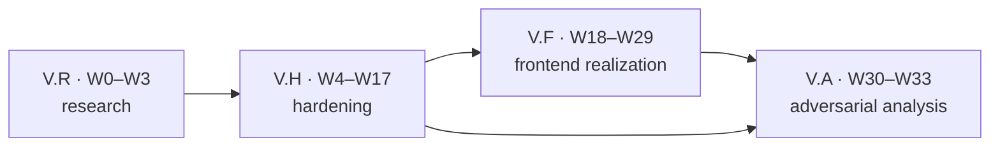

> ARCHIVED 2026-07-17 — historical; superseded by V-PRIME.md (the standing authority; see reformation/FORMATION-CLOSED.md). Read-only.

# Tranche V — Optical Bench

**Formation state:** AMENDED CANDIDATE · `0/2` after V-A168 · Value `4.0.0` and Keyframes `6.0.0` producer rows are immutable and shipped; Glass source/lock is LANDED/IMPLEMENTED but dirty, while Q003 product integrity on the restored honest 5/0 baseline, fresh Glass7 publication, routed mount, UI/accessibility/proportion and API search/error/provenance rows remain RED; no tranche close

**V-A137–V-A154 current RED addition:** SpectrumCanvas and ConsoleRail accessibility contracts are incomplete, About retains empty/duplicative affordances, ColorSpaceSelector's label/headline pair skips the required adjacent P019 rung, and the palette API/client still has concrete closed-wire, cursor, idempotency, lineage and session-recovery defects. These are concrete W10–W24/W18/W20/W21 obligations, not meta-gate work.
**Date:** 2026-07-15
**Scope:** frontend realization, palette-domain truth, and the architectural hardening required to make both durable

This document, its referenced contracts/waves, `ADDENDA.md`, and the current execution summary in `HANDOFF-2026-07-16.md` supersede `DESIGN-CAMPAIGN.md` and `HANDOFF-2026-07-13.md` as the current V authority. W0 may read the old campaign and `design/**` material once for provenance; W4 then deletes those two superseded documents and the entire `design/**` tree, including `design/portfolio.md`, every pass charter/status file and every executable instrument. Their resolved substance survives only in the current decisions, ledgers, current handoff and `research/CONVERGENCE.md`; their forks, gate battery, stale counts and `2.0.0` framing are not a legacy plan.

**V-A168 current-stage override, superseding V-A130's decline shorthand:** Value4 and Keyframes6 are immutable and the registry-only pair graph is proven. Any older W3/W7/W17/W33 bootstrap, producer-rehearsal, U-F77/B1/B14 ordering, Consumer-Cut/W2 producer procedure or ordered-publication text below is historical/retired. The active task is singularly Glass-owned: from the honest 5/0 baseline, close strict declarations/HeaderRibbon and Q003 with repeated native forward/reverse Browser cycles showing zero slab, occlusion corruption and lost target; remove stale Value3 names from the tracked demo canon; emit one fresh Glass7 rehearsal through W17a; publish it through W33a; then refresh the stale value consumer through W17b. A causal hypothesis may be declined, but a corrupt product may not. Keyframes and Drawer remain untouched; Chromium prior art is not a wait condition.

**V-A131 current-stage addition:** the active Glass source/lock is LANDED/IMPLEMENTED but dirty; the earlier 176-file/1,131-test/771-module report is historical and V-A134 supersedes it. Current direct evidence is 176 files/1,132 tests and typecheck green, while fresh build/pack/verifier evidence is unavailable in the current sandbox. These facts do not promote the held 966,350-byte archive or create a Glass7 release coordinate. Q003 remains ACTIVE RED on the honest 5/0 baseline, and W17/W33 still require a fresh strict/native packed artifact before downstream locks or the routed mount are refreshed.

**V-A132–V-A135 current RED additions:** the required π/DELTA manifests are absent; the API route table/client still carries concrete legacy “SHIPPED” and token/endpoints; and the live demo router lacks `/about` and `/easing` rendered surfaces. These are named W0/W1/W17/W19/W20/W27/W29/W31/W32 obligations, not formation-complete contracts. They remain RED until their owning waves produce the cited artifacts and Browser/runtime evidence.

**V-A136 current RED addition:** the inert Configurator backing-plane experiment reached 3 active/0 nested filters and still failed native capture; it is fully reverted. Honest 5/0 is current and Chromium-only attribution is withdrawn. Q003 remains Glass-owned ACTIVE RED; no workaround earns credit.

**V-A161–V-A164 current RED additions:** the palette API still has regex color-search fallback, fabricated malformed-Problem fallback, caller-controlled proposal attribution and raw fork/ancestor provenance exposure. W10–W16/W22–W23 own clean replacements and deletions; no local masking or alias path is admissible.

**V-A165–V-A168 execution corrections:** the live release rail is W17a fresh strict/native rehearsal → W33a nonterminal Glass7 publication → W17b registry consumer refresh/routed mount → W18–W32 → W33b final close. W18 additionally depends on W6. W29's before packet must be reconstructed from an immutable pre-change identity, and a declined Q003 causal hypothesis never authorizes an artifact while any slab, occlusion or lost target remains.

## 1. Mission

V fully realizes value.js as a chromatic laboratory. Its dominant product form is the **Optical Bench**: one active instrument, proportionate supporting space, neutral glass structure, a denser veil only where controls genuinely sit over live color, and watercolor marks only where color is data. The palette system is rebuilt as an honest domain rather than a collection of optimistic CRUD calls. The library, demo topology, and sibling cut are hardened only as far as those product outcomes require.

`OPTICAL-BENCH-COMPOSITIONS.md` decides desktop/mobile topology for the eleven named member routes plus Users, Names, Audit, Flagged, Tags, Account and storage recovery before execution. The closed member inventory is `/`, `/palettes`, `/browse`, `/extract`, `/mix`, `/generate`, `/gradient`, `/easing`, `/atmosphere`, `/blob`, and `/about`: About and Easing are first-class destinations, not orphaned companions. Admin loses its five forced Palettes companions, Account remains an overlay, storage recovery remains an inline Library state, and the shell retains the sole `<main>`. `PROPORTION-AUDIT.md` and `research/proportion-register.md` make that topology executable at card and micro-UI scale: every region, title, readout, interval, divider, icon, ornament, status and handle terminates as KEEP/TIGHTEN/ENLARGE/REMOVE/ADD-AFFORDANCE under one owning feature wave. Browse/Library retain exactly one Card per rendered palette entity and the other sixteen compositions retain none; every P122 workbench selects boundaries `[]`/reserve `none`; only the five Admin fields retain a named adjacent-row separator. The 2026-07-15 Lab crop is a born-RED anchor with an exact rendered-ink inequality, not a taste note. `PALETTE-FACILITIES.md` fixes method/path/product scope; `PALETTE-WIRE-CONTRACT.md` closes bodies, queries, items and Problems; `PALETTE-CURSOR-CONTRACT.md` closes every paged scan coordinate and byte; `PALETTE-OPERATIONS-REPLAY-CONTRACT.md` closes mutation binding and permanent replay; `PALETTE-LOCAL-RAIL.md` closes the real-HTTPS development profile; `LEGACY-PALETTE-SOURCE-CONTRACT.md` closes all nine cut inputs; and `PALETTE-EXPORT-CONTRACT.md` closes all five output byte formats.

V is a clean break:

- no `demo/@`, project aliases, `@src`, forwarding barrels, compatibility package root, migration shim, dual parser protocol, wildcard CAS, substitute-color fallback, or schema-v1 read path;
- no public-handle-as-credential, global-hash version identity, process-local idempotency, or mocked CRUD claim;
- no gray entrance stage, equal-column empty-card tax, three-register action cluster, glass-on-glass garnish, or headless visual attestation;
- no new proof framework. Ordinary builds, typechecks, unit tests, real-stack journeys, browser measurements, and a small tracked visual record are the evidence.

Execution is Browser-first across the tranche. Every visual π begins by opening, inspecting and capturing the live routed state in the in-app Browser; implementation then proceeds as one bounded inspect→change→reinspect loop. Computer Use or headed hardware is reserved for native assistive technology, OS/browser chrome, real-device, Safari-only or GPU surfaces the Browser cannot expose. Standalone/headless Playwright is limited to named cross-engine binary automation, exhaustive repetition or synthetic timing the Browser cannot express; it may never author a visual decision or attest gestalt. Literal repository names such as `bench/playwright.bench.ts` remain file coordinates, not a tool preference or exception.

## 2. The four meta-tranches

| Meta-tranche | Waves | Product question | Terminal output |
|---|---:|---|---|
| **V.R — Research** | W0–W3 | What is actually red, who owns it, and which mechanism wins? | state atlas, palette failure lab, target graph, Glass ask/status decision |
| **V.H — Hardening** | W4–W17 | Can the chosen design stand on one topology, one domain model, and one sibling surface? | subtraction, clean module graph, truthful palette stack, post-BI Glass adoption |
| **V.F — Frontend Realization** | W18–W29 | Does every pane read as one proportionate glass-ui instrument? | complete Optical Bench UI across every feature and state |
| **V.A — Adversarial Analysis** | W30–W33 | Does the whole product survive non-pointer, narrow, slow, real-GPU, packed, and release conditions? | cross-modal truth, Web Vitals, concise π/DELTA record, ordered clean-break cut |

Research is limited to four concrete waves. It does not mint process machinery; each research artifact is consumed by a named build wave.

## 3. The 34-wave DAG

| Wave | Name | Depends on |
|---|---|---|
| W0 | Prompt and product-state atlas | — |
| W1 | Palette adversarial failure lab | — |
| W2 | Topology and final-object prototype | — |
| W3 | Post-BI Glass reconciliation and ask decision | — |
| W4 | Repository subtraction | W0–W3 |
| W5 | Physical demo topology | W2, W4 |
| W6 | Feature ownership, content, and style | W0, W5 |
| W7 | Sole package surfaces | W2, W4, W8, W9 |
| W8 | Final Color/Value objects and Browser Extraction | W2, W4 |
| W9 | One parse result and grammar composition | W2, W8 |
| W10 | Principal, admin, platform, and schema trust | W1, W4 |
| W11 | Palette handles, workspaces, releases, access, and lifecycle | W1, W7, W9, W10 |
| W12 | Generations, history, and provenance | W11 |
| W13 | Durable commands, votes, forks, and counters | W10–W12 |
| W14 | Catalog, search, and pagination | W11, W13 |
| W15 | Client auth, transport, drafts, and operation truth | W6, W11–W14 |
| W16 | Real-stack palette API and transport | W10–W15 |
| W17 | Post-BI Glass adoption and constellation cut | W3, W7–W9 |
| W18 | Visual constitution: material, type, and proportion | W0, W6, W17b |
| W19 | Shell, dock, header, navigation, and scene continuity | W17, W18 |
| W20 | Picker hierarchy, readout, and selector | W18, W19 |
| W21 | Slider console, spectrum, and veil | W18, W20 |
| W22 | Palette library, cards, browse, search, and states | W15, W16, W18–W21 |
| W23 | Palette lifecycle, social actions, history, and inventory | W15, W16, W18, W19, W22 |
| W24 | Admin review suite | W10, W16, W18, W19, W22, W23 |
| W25 | Generate workbench | W17–W19, W21, W23 |
| W26 | Extract and Mix workbenches | W18–W21, W23 |
| W27 | Gradient and Easing workbenches | W17–W21 |
| W28 | Chromatic boot and Aurora | W17–W21 |
| W29 | Blob material studio and configuration | W17–W21, W28 |
| W30 | Keyboard, mobile, zoom, RTL, and assistive truth | W16, W19–W29 |
| W31 | CSS-first first paint, fonts, chunks, and Web Vitals | W17, W19–W30 |
| W32 | Real-GPU gestalt and concise π/DELTA record | W19–W31 |
| W33 | Canon, packed constellation, and ordered release | staged: W33a after W17a; W33b after W17b and W30–W32 |

The detailed file bounds, disjointness rules, RED witness, completion evidence, artifacts, and commit slice for every row live in `waves/W<N>.md`.

**HISTORICAL (V-A123), corrected by V-A165:** Wave numbers are owner IDs, not execution order. The C1 W8→W9→W7 producer cut and its exact-seven transport are complete and superseded by immutable Value4; Keyframes6 is likewise immutable. The remaining constellation path is the explicit acyclic W17a→W33a→W17b→W18–W32→W33b rail; W15 remains an independent palette-client rail. No placeholder, alias, independently merged partial C1 or registry compatibility window exists.

### Worktree default

Unless a wave names a stricter placement, each implementation wave uses one dedicated `v-w<N>` worktree/branch in the repository it owns. Parallel units may share that worktree only when their file bounds are disjoint and one integration owner is named. W2 uses a disposable prototype, W3 is read-only plus coordination, W4 uses the primary value.js worktree for repository-only cleanup, W17 uses coordinated per-repository cut worktrees, W28/W29 use a headed real-GPU worktree, and W33 uses authorized release branches. Formation creates none of them.

## 4. Chosen mechanisms

1. **Optical Bench, not dashboard.** A two-part P122 instrument uses one of two exact producer proportions: golden `61.8033989% / 38.1966011%` or preview-dominant `66.6666667% / 33.3333333%`. The display-rounded active-content law is therefore 61.8–66.7%, not a contradictory 62% floor. Empty secondary content collapses to a tray or disappears. Mobile uses one document-scrolling stage→inspector→action sequence beneath the same reserved top dock; no global pane selector or split state survives.
2. **Immutable releases plus mutable workspaces.** Public artifacts never change underneath readers. Palette-local release identity is distinct from globally deduplicated immutable content.
3. **Disciplined final objects.** One closed, immutable generic `Color` representation and focused immutable CSS syntax/value objects replace the subclass forest, dynamic indexes, late registration, and DOM-tainted values. Keyframes owns a distinct mutable `InterpSlot` compiled from them; value.js does not contaminate its public values with animation mutability.
4. **CSS-first progressive enhancement.** A palette-honest CSS ground and semantic shell are a complete first product frame. Aurora and Blob renderers arm after the LCP plate without changing geometry.
5. **Capability subpaths only.** `/color`, `/value`, `/css`, `/easing`, `/math`, `/transform`, and `/quantize` are the only package entries. The broad root and the old `/units` and `/parsing` names die across every active first-party consumer enumerated in `CONSUMER-CUT.md`, not only inside the three-package core. The unconsumed `/browser` proposal also dies; Keyframes owns the one live DOM-resolution/cache mechanism and imports only `/value`'s pure classifier.
6. **One semantic component vocabulary.** BI's `InstrumentChassis`, `Dialog`, `Drawer`, `Tooltip`, `Popover`, `Chip`, Dock family, and `Slider` replace consumer synonyms according to each call site's behavior. No blanket rename, local forwarding wrapper, or duplicate housing recipe survives.
7. **Ordered release (historical producer order; live remainder Glass-only).** Value4 and Keyframes6 have shipped under their observed provenance coordinates. W17 selected `G_NEXT=7.0.0` from the Glass packed diff against immutable `6.0.0`, including eleven clean-break public subpath removals; W33 now creates and observes only the fresh Glass7 candidate, then downstream consumers bump. Glass BI's published `v6.0.0` remains immutable at peeled `e5b3a2095b6c3e330b5d82ca3330f1eac4e3c895`; a fresh Glass7 artifact is still open. The stale-artifact/conditional-prepare law remains a W33 release invariant.
8. **Byte-preserving same-origin edge.** Non-proxying DNS reaches one dual-stack L4 TCP load balancer with PROXY v2, then redundant private NGINX+njs/QuickJS TLS edges serving both immutable SPA and relative `/api`. One raw-buffer dispatcher validates the original request target before routing, reconstructs a closed header set, and reaches the sole private TLS Hono origin only through mTLS plus a header-bound MAC; it fully settles bounded cookie-changing **origin** responses. The local profile runs that same artifact behind trusted local HTTPS/PKI, never an unsigned bypass. Browser-global ordering of already-emitted same-name cookies is not claimed; stale state fails closed into explicit recovery. Cloudflare HTTP normalization, plaintext/public/direct API and CORS alternatives are retired.

**Current immutable correction:** V-A9's `E404` and mechanism 7's P127 wording are historical antecedents only. V-A109 observes the shipped Value producer: `@mkbabb/value.js@4.0.0`, tag/gitHead `44ddaff7a22283a4f7a42608893eeae7bc234424`, npm integrity `sha512-Z8ywb4htSxJlRFvoU1DNtvzr9Bsuaw9ahT/hvNlKbnRj6fTnLuXjn0itKq1Q5s6rwg24ct0zcLZ04BuR3/SzGw==`, provenance run `29497728532`. V-A117 observes the shipped Keyframes producer: `@mkbabb/keyframes.js@6.0.0`, gitHead `5a9183a7afe24702081a7b87c8adc7286ddce9a0`, tag object `26190755ce1e57c54cb14ef0a454ae02ed2b3da0`, npm integrity `sha512-mpb3gSxU8UgO4HBBG2he6CFNCq7tW+k9id82DgAjeeDdeAmtEzmZ2/kuK3j5AbUZRULcN1QNkNJychNk49bT4Q==`, shasum `5cc5fdecb886f4df33371d3358239594a8965b6b`, provenance run `29499708034`. Bootstrap/rehearsal bytes remain non-release; Glass, W17 and W33 remain open.

**Current Keyframes correction:** V-A115's registry-only lock/npm-ci evidence and V-A116's clean producer checks culminated in V-A117's immutable registry release. Glass now consumes only the published pair and must produce its own fresh immutable artifact; no held Glass archive supplies release credit.

V-A9–V-A12 amend the library/Glass cut without adding waves. Glass's smallest honest value 4 subset is exactly `/color`, `/css`, and `/easing`: its live CSS-color and timing-readback consumers make the former two-entry `/color`+`/easing` claim impossible. W9 owns `/css` `parseCssColor(source:string): ParseResult<CssColor>`, `serializeCssColor(color:CssColor): Result<string,ColorIssue>` and `parseTimingFunction`; `CssColor` is the closed thirteen-space CSS-native union, while all seventeen spaces retain factory/conversion/object-oracle coverage and the four library-only spaces must explicitly convert before serialization. W7 owns the packed entries; `/color` exposes only failure-explicit final-object operations; and `/easing` exposes named easing functions plus the exact `CubicBezier`, `steppedEase` and dynamic `easing(name)` Result constructors without a `timingFunctions` aggregate. W17 owns exact Glass imports, externals and ordinary consumer tests. It also removes silent empty/default/identity substitutions and the empirical `minContrast * 0.1` lightness proxy as a claimed contrast proof, and keeps Aurora plus Value 4's public `interpolateHue` in the physical-degree domain with named warm/cool direction vectors; normalized-turn helpers remain GPU-local. The direct producer ruling was sent to active Glass task `019f6610-6022-7df1-95b3-472b17a64656`; that relay is not an artifact, implementation or publication claim.

V-A13–V-A21 close the post-amendment tails without adding waves or process: row-specific replay ETags; selected-color-bound non-live meters; exactly two pastel `Palettes` sites; the complete non-cherry-pick route/chunk/hardware matrix; no `RE-DEADLINED` close; current-public-documentation censuses; exact asset bytes separated from tolerated dynamic rendering; independent anchor oracles with no legacy direct path; and BANK terminally outside V.

V-A22–V-A39 close the final pre-freeze contradictions without adding waves: one exact nonempty parse-failure protocol; CSS-native `CssColor` parse/serialization while all seventeen final spaces remain; Fourier's aggregate-free easing cut; W17 rehearsal versus W33 sole-candidate byte/hash provenance; acyclic W31 activation ownership, exact per-route interactions and a separately counted boot matrix; downstream meter, two-site identity and P047 π propagation; persisted grant/policy attribution and namespaced schedulable-versus-terminal purge episodes; explicit recap of the current convergence/addendum/fanout fences; and corpus-wide removal of the two stale candidate/spelling claims.

V-A40–V-A52 close the earlier post-audit mechanisms without adding waves or process: one immutable 36-entry interaction manifest with product-real accessible targets; exact audit-subject and half-open time-window query unions; one publishable candidate distinct from an optional deleted verifier; compilable exact runtime/type declarations for every public entry; followable sibling coordinates and nonterminal Glass vocabulary; the then-complete `/css` grammar surface; declaration-list `!important` precedence; source-span-valid parsing followed by total selected-list projections; and context-preserving located stylesheet rules with no duplicate-keyframes concatenation.

**HISTORICAL (V-A123):** V-A53 records the correction-time disk baseline rather than a permanent execution-state assertion: at that correction Value was 3.1 with root/`/parsing`/`/units`, stale-output prepare and no Value-4 declarations or tarball. The delegated C1 later closed and Value4 shipped. No current source/package/test delta implies a producer rehearsal or publication; W17 now enters the Glass-only strict/native close after the immutable pair.

V-A54–V-A57 make the frontend verdict single-valued: retained palette Cards use one compact quiet opaque producer tuple; every typographic role and About's 66ch measure has one rung; Picker selection has one visible producer marker independent of focus and face paint; and the exact Lab gap/Blob geometry relation survives 320px plus actual 400% zoom. V-A58–V-A61 remove failure-audit and purge-repair dual paths, replace unbounded rank events with one coalescing leased build state, and bind every public count/score/cursor coordinate to JSON-safe unsigned integers. V-A62–V-A65 restore Keyframes dirty-tree truth, add the missing named-range selector offset/parser and three live easing exports, and remove W3's rehearsal/artifact dependency cycle. `/css` is consequently exactly 19 runtime/33 type exports with ten source-consuming `ParseResult` functions; `/easing` is exactly 16 runtime/five type exports with nine named numeric functions.

V-A66–V-A68 make the release-through-visual rail single-owned: W3 is status/ask reconciliation only, live C1 state comes only from `PROGRESS.md` without crediting partial work, W17 freezes the four-case P047 producer baseline, and W29 alone changes the Picker paint parameter and records the final mass/centroid/hull/0px-geometry verdict.

V-A69–V-A72 close the last product-contract ambiguities without adding machinery: principal aftermath exposes exactly five named counters; Browse/Library selection is one native pressed-button seat rather than orphaned `aria-selected`; committed-effect AuditEvents have one exhaustive cardinality/projection/digest/correlation construction table; and Picker's Blob deletes Tooltip, press semantics, activation listeners and duplicate Copy so the action region owns the sole Copy. `PROGRESS.md` distinguishes locally implemented slices from complete waves and final native/artifact evidence.

V-A73 restores C1's already-specified atomic boundary after the in-app Browser reproduced the broken intermediate graph: W8→W9→W7 owns package/source/tests **and every value.js-internal demo consumer**, while W17 begins at sibling repositories. Deleting root/`/parsing`/`/units` and migrating the complete active demo import/name/kind graph land together; no old export or alias may bridge them.

V-A74 closes the vacuous-green tail of that witness: a zero-overlay atmosphere with an empty `#app` is still broken. After W17 replaces the pinned sibling graph, the canonical routed Picker must mount its nonempty product subtree, sole `<main>`, selected-space control, numeric headline and sole ActionToolbar Copy before the Browser observation can support W17 or any later whole-app claim; it is not a W7 prerequisite.

**HISTORICAL / V-A136 correction:** V-A75–V-A84 established the acyclic exact-seven rail and grammar repairs. The 36,378-byte and 36,447-byte packs remain held; V-A85 supplies historical transport evidence and focused Keyframes consume. W17's historical Keyframes rehearsal lineage was replaced by immutable Keyframes6 after Glass exposed its packed-runtime leak. Glass now consumes only immutable Value4 + Keyframes6; its current direct source observation is 176 files/1,132 tests with typecheck green, while fresh build/pack/verifier/native Q003 evidence, Glass7 bytes, full build and nonempty mount remain open. W33 alone records release coordinates.

**HISTORICAL / SUPERSEDED BY V-A136:** V-A108 records the 184,710-byte Keyframes archive being held and the independently rehashed 184,254-byte replacement used for strict consumer rehearsal. V-A94 holds aperture completion; the former V-A95 `PENDING-HEAL`/Chromium attribution is withdrawn by V-A125/V-A136 after the reverted 3/0 backing-plane experiment also failed. V-A96 records the former public-declaration blocker. V-A97–V-A107 preserve the immutable Value→Keyframes→Glass order, physically partition demo tests, restore meaningful exact-seven behavior/type coverage, close CSS/quantize/contrast defects and make the one ESM/provenance candidate exact. Those transport and source-tree facts are retained as evidence only: Value4 and Keyframes6 are now immutable, and Glass's current direct source run is 176 files/1,132 tests with typecheck green. The live remainder is Glass Q003/native and strict closure, a fresh Glass7 artifact, and the stale consumer/routed-mount refresh; no Keyframes workaround or producer republish is implied.

The rejected and banked routes, all old owner forks, the U-F1…U-F77 rows, and the T/K/N/recent-prompt recap are terminally disposed in `DECISIONS.md`, `DISPOSITION-LEDGER.md`, and `PROMPT-RECAP.md`.

## 5. Evidence without ceremony

Every wave has one **completion evidence** section. That section is the precepts-required hard-gate field; there is no second gate system. It may use only:

- a direct product reproduction that turns green;
- an ordinary build, typecheck, unit or real-stack test;
- a packed-consumer build;
- a Browser-first live-routed measurement, with headed escalation only for a named Browser-inaccessible surface;
- a concise visual pair and its named DELTA.

No wave may create a ledger parser, source-token oracle, expected-red counter, screenshot census, custom complexity gate, or proxy benchmark. Structural counts are diagnostics, never product authority.

The standing format cadence is equally small: format after each bounded implementation unit and once before its commit. It is ordinary hygiene, not a wave-specific ceremony.

For product claims, π means the minimum decisive real-rendered witness: a frame pair for static form, synchronized filmstrip/trace for motion, frame plus input/assistive transcript for accessibility, trace/waterfall plus relevant frame for performance, or renderer-identified temporal sequence for GPU behavior. DELTA names the geometry, contrast, timing, color, interaction, speech, or network change that explains it. `EVIDENCE.md` defines the small required matrix. Untracked screenshot hoards are forbidden.

## 6. Formation return contract

V is ready to execute only when all of the following are true:

- W0–W33 specs exist and form an acyclic graph;
- every live defect has a current RED witness and named wave;
- every visual wave has proportionate π/DELTA obligations;
- all eighteen decided compositions have one implementation owner, mobile sequence, Card decision and main-landmark count;
- every proportion-register row has one terminal verb, owner and decisive rendered relation;
- every prompt, chronic, deferral, owner fork, partial, and design route is built, folded, banked with a named re-trigger, or retired with rationale;
- all 52 live palette routes/five exports and all active first-party package consumers have terminal facility/cut rows;
- the named post-BI glass executor owns every producer change and value.js owns every consumer adoption;
- two fresh non-author audits find no unowned row, impossible completion check, hidden alias, or product-scope omission.

No product source change belongs to formation. Cross-repository authority is inbox-only: formation may add the exact executor letter at `../glass-ui/docs/tranches/BI/coordination/valuejs-inbox-2026-07-15-v-formation.md`, while this V tree records the immediate post-BI Glass routing and retained P-coordinate amendments as guidance. It does not edit glass producer source, execution machinery, status claims, `INBOUND-MARKS.md` or `asks-and-consumes.md`; the post-BI Glass executor owns those integrations and terminal dispositions.
