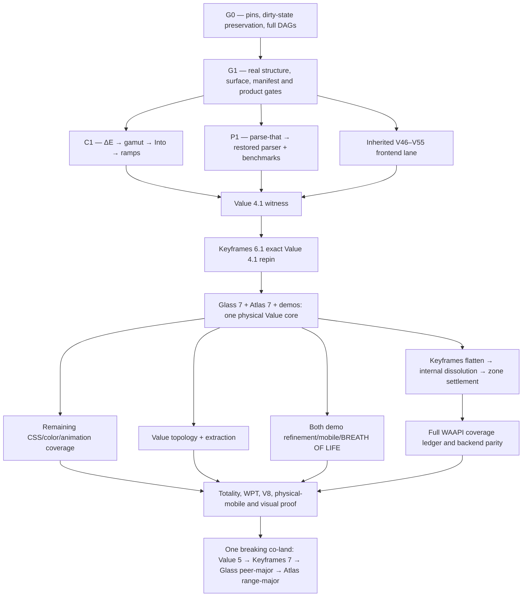

The formation has converged, but the tranche corpus could not be landed: this workspace is mounted read-only, and the write attempt was rejected. No source, documentation, browser state, or existing user work was changed.

## Converged tranche: W

The sole seed remains the [refined kickoff](/Users/mkbabb/Programming/value.js/docs/tranches/V/coordination/keyframes-inbox-2026-07-18-vnext-ingestion-prompt.md) and [P0–P6 handoff](/Users/mkbabb/Programming/value.js/docs/tranches/V/coordination/keyframes-inbox-2026-07-18-vnext-formation-handoff.md). The quarantined r1 corpus was never loaded. Two Sol skeptics and a third Sol adjudicator returned clean after modifications; no Luna participated in formation.

The selected architecture is release-stratified:



The intended corpus under `docs/tranches/W/` is fully specified as:

- Authority: `W.md`, `PROMPT-RECAP.md`, `RETURN.md`
- Truth: `PIN-LEDGER.json`, `DAG.md`, generated runtime/type/full graph manifests
- Decisions: `RESTORE-LEDGER.md`, `SPEC-COVERAGE.md`, `DISPOSITIONS.md`, `OWNER-DECISIONS.md`
- Execution: `CARRY-LEDGER.md`, `EVIDENCE.md`, `PROGRESS.md`, standalone `waves/*.md`
- Formation: `FORMATION-REGISTRY.md`, `CONVERGENCE.md`
- Coordination: inbox plus Value→Keyframes foundation, publish, and co-land letters; post-parser PT-E amendment

## Settled technical program

Value 4.1 restores R-DELTAE through R-RAMP: ΔE OK/2000/ITP, analytical gamut mapping, the extended caller-owned `Into` family, parse-that parsing, and ramp sampling. Its seven v4 subpaths remain frozen.

Keyframes 6.1 then exact-pins Value 4.1, consumes those capabilities, deletes its local ΔE/ramp scars, and preserves both package subpaths and its 44-key engine mirror. Glass 7 and Atlas 7 require lock/test repinning only; their current peer ranges already admit the witness tuple.

The final major program settles:

- Value: typed `color-mix()`, relative colors, `contrast-color()`, OKHSL/OKHSV, HDR syntax, `spring()` grammar, animation/keyframe/timeline parsing, gradients and relevant CSS Values syntax.
- Keyframes: full WAAPI backend parity plus an implement/feature-detect/refuse row for every applicable Level 1 and Level 2 member.
- No public static CSS evaluator: context-dependent expressions remain typed and round-trippable without pretending to be a browser cascade.
- `spring()` grammar belongs to Value; solving belongs to Keyframes.
- SoA remains benchmark-triggered; boundary samplers remain W53-evidence-triggered.
- Public bounce half-curves are tombstoned as API sand.

The standards matrix is pinned to the current official drafts for [CSS Color 5](https://drafts.csswg.org/css-color-5/), [CSS Color HDR](https://drafts.csswg.org/css-color-hdr-1/), [CSS Values 5](https://drafts.csswg.org/css-values-5/), [CSS Images 4](https://drafts.csswg.org/css-images-4/), [Easing 2](https://drafts.csswg.org/css-easing-2/), [CSS Animations 2](https://drafts.csswg.org/css-animations-2/), [Web Animations 2](https://drafts.csswg.org/web-animations-2/), and [Scroll-driven Animations](https://drafts.csswg.org/scroll-animations-1/). “Full CSS coverage” is defined honestly as full typed coverage of Value’s color/value/gradient/easing/animation/keyframe/timeline boundary—not selectors, cascade, or layout.

Keyframes zone verdicts are now terminal:

- Keep: DrawSVG, scroll, ingest.
- Agglomerate: FLIP plus physics/morph into one layout-transition domain.
- Prune: split-text, the convenience MotionPath wrapper, and Oscillator.
- Preserve the generic engine’s ability to animate `offset-*`; only the redundant wrapper is removed.

## Topology verdict

Current graph evidence:

- Value library: 26 modules, 44 internal edges, zero cycles.
- Value demo: 247 production modules, 650 edges, four real cycle families.
- Value API: 83 production modules, 249 edges, zero cycles.
- Keyframes library: 153 modules, 627 internal edges, zero runtime cycles and four type-layer rings.
- Keyframes demo: one runtime SCC in orbital drag.

Keyframes flattening is exactly `src/animation/** → src/**`, proven by normalized pre/post graph equality. Pruning, public changes, `internal/` dissolution, and demo moves are separate clusters.

The two demos share architectural laws, not directory shapes. Keyframes remains scene/instrument/transport-oriented; Value remains Bench/picker/palette/workbench-oriented. Shared modules require two independent domain consumers, barrels remain pure, self-barrel imports are forbidden, grouped filenames lose redundant module prefixes, and tests live in external isomorphic trees.

The recent Claude-Code checkout is preserved, not canonicalized: `/Users/mkbabb/Programming/keyframes.js` contains 348 dirty paths. Its pre-stage snapshot accounts for the transaction. A K0 salvage manifest must classify the 104 non-identical/missing rows; reset or cleanup is forbidden without explicit owner authority.

## Mobile and BREATH OF LIFE

Value’s Optical Bench is preserved and refined, not redesigned. Pure topology work requires rendered DELTA=0; visual fixes require named masks and measured defects.

The mobile tools bar is now a born-RED shell defect. Every primary tool must remain reachable, active state visible, safe-area aware, keyboard-viewport safe, and operable at 200% zoom.

WatercolorDot remains decorative Glass paint:

```text
native Value-owned button/trigger/readout
└── aria-hidden, pointerless WatercolorDot
```

All current `tag`, click, disabled, and ARIA misuse on the dot must disappear. Dots may sit behind slider readouts, never replace Slider thumbs or input geometry. Glass owns deterministic paint and optional one-shot birth rendering; Value owns when birth happens and all semantic hover/focus/press/value-change choreography. No per-value turbulence reseeding and no idle rAF.

Keyframes mobile receives:

- One scroll owner, safe-area-aware bounded sheets, accessible compact scene selection, 44px controls, and lazy-mounted Monaco.
- A private pointer-flight kernel owning pointer IDs, capture, cancellation and two-pointer geometry only.
- Cube-local quaternion mapping: one-finger orbit; two-finger pan, logarithmic pinch, and shortest-angle twist; seamless 1→2→1 transitions; no hot-path allocation.
- One final Pointer Events path. Touch/Gesture rails are removed only after physical iPhone/iPad Safari and macOS Safari evidence; failure blocks release rather than preserving dual paths.
- Meaningful touch, mouse/pen and keyboard parity for Cube, Amiga, Square, Easing, Spring and Sequence.
- Reduced motion preserves direct manipulation while eliminating glide, overshoot and moving specular effects.

## Parse-that verdict

Published parse-that 1.0 is fit for Value’s restoration boundary: 124/124 tests and its full proof suite passed, with all historical Value symbols and subpaths present. No parse-that uplift blocks R-PARSER.

After restoration, one PT-E amendment carries actual diagnostic/type-inference consumer anchors. Tape, substrates, Pratt, Rust regex work and bbnf restart remain routed to their own tranche set.

## Remaining owner-only decisions

Only four decisions remain genuinely subjective or destructive:

- Supported Safari floor/device pair.
- Final visual blessing and WatercolorDot birth amplitude/tempo.
- Extracted palette API destination, history and deployment ownership.
- Final disposition of the preserved dirty Keyframes checkout.

Persistence is the sole immediate blocker. Re-run this task with write access to `/Users/mkbabb/Programming/value.js`; the converged corpus can then be materialized and verified without repeating the audit.
The mega-tranche is fully formed and adversarially converged, but workspace persistence is blocked by the active Codex sandbox.

- 156 direct waves: `P 8 + V 33 + K 25 + A 32 + G 7 + D 28 + M 12 + C 11`.
- Passes 10 and 11 were consecutively clean under two hostile Sol-role critics and Luna-role adjudication.
- No production implementation began.
- Both seed letters were honored; the quarantined r1 corpus was never loaded.
- All 14 value routes and 7 keyframes routes were audited across desktop, tablet, mobile, and compact layouts.
- The Claude Code JSONL history—not merely its workspace—was audited.

Binding results include:

- One production CSS spine in value.js; BBNF is an independent executable witness.
- Full pinned [CSS Snapshot 2026](https://drafts.csswg.org/css-2026/) and [Webref](https://w3c.github.io/webref/) inventory with explicit typed, contextual, delegated, preserved, or refused status.
- Normative [CSS Color 4](https://drafts.csswg.org/css-color-4/) local-MINDE gamut mapping; cusp/Halley only as an optional fast policy.
- parse-that limited to 1.1, with whole-CSS prototypes preceding the canonical isolated run context and module transpose.
- Complete value/keyframes target DAGs, external isomorphic tests, clean package direction, and terminal keyframes facility dispositions.
- Palette API retained inside value.js `/api`, with immutable IDs/revisions, complete CRUD/history/forks/variants/mixing/tags/names/votes/flags, secure sessions, and Fourier protocol isomorphism.
- Separate palette content, CAS, social, moderation, and audit histories.
- Versioned typed URL state and sharing for both demos.
- Total app-level shadcn abrogation, direct glass-ui/Tailwind v4 use, and named missing glass primitives.
- Optical Instrumentarium and Chronographic Stage design programs, including the mobile toolbar repair, bounded keyframes inspector, lazy Monaco teardown, and quaternion multi-pointer input.
- Atmosphere is settled as a compact environmental-palette instrument; no generic slider wall. Keyframes authoring remains within Sequence, not a new route.

The intended artifact root is:

`/Users/mkbabb/Programming/value.js/docs/tranches/V/vnext/`

It was to contain the charter, provenance, current/target DAGs and trees, standards matrix, parser/color/keyframes/API/design programs, dispositions, formation record, return contract, wave books, and cross-repository coordination letters.

The first `apply_patch` was rejected verbatim:

```text
patch rejected: writing is blocked by read-only sandbox; rejected by user approval settings
```

Your authorization is clear, but it cannot override the enforced filesystem profile. Please continue this task in a writable workspace; the converged 156-wave registry can then be persisted without repeating formation or beginning tranche execution.
The mega-tranche formation is analytically complete but not persisted.

- 156 fully specified waves: P 8, V 33, K 25, A 32, G 7, D 28, M 12, C 11.
- Every wave has dependencies, born-RED evidence, deliverables, falsifiable gates, exclusions, and return contract.
- Passes 10 and 11 were consecutive clean hostile-review passes.
- Parser/CSS/color, keyframes/WAAPI, palette/Fourier CRUD, DAGs, URL state, shadcn abrogation, every-route responsive design, Breath of Life, consumers, and coordinated release are covered.
- No production execution began and no existing user work changed.

The write-ready corpus comprises 16 documents, including four wave books, formation/provenance/DAG records, design and parser programs, binding dispositions, and routed handoffs.

Persistence to `/Users/mkbabb/Programming/value.js/docs/tranches/V/vnext/` is the sole remaining step. The filesystem rejected the write with: `writing is blocked by read-only sandbox`. The workspace must be reopened writable to land the corpus; the goal remains active, not marked complete.
The goal is now marked blocked after the third consecutive read-only continuation.

Authoritative recheck:

- `docs/tranches/V/vnext/` does not exist.
- `docs/tranches/V/` is not writable.
- HEAD remains `c654824e0b25` on `tranche-u`.
- Existing user changes remain untouched.
- The 156-wave specification corpus is fully rendered but cannot be persisted.

Resume this task in a writable workspace to land the tranche documents; no production execution should begin yet.
Your authorization is clear, but the sandbox remains system-mounted read-only. The real `README.md` patch was rejected with:

`writing is blocked by read-only sandbox; rejected by user approval settings`

Please switch this task’s workspace access to writable/write-enabled, then say “continue.” I cannot override that mount from inside the task.
The permission change has not propagated. A second real patch attempt was again rejected by the read-only sandbox. The goal remains active; no files or user changes were touched.
The third resumed write attempt was rejected by the same read-only sandbox. I’ve marked the goal blocked again. The rendered 156-wave corpus remains preserved; no repository files were changed.
null
null
Not yet converged. We are close in tranche topology, but not in admissible proof.

I deployed three independent Agent v2/Sol-ultra audits—wave inventory, convergence integrity, and prompt coverage—followed by a fresh Sol-ultra adjudicator. The adjudicated status is:

| Measure | Current state |
|---|---:|
| Wave rows/contracts | 190/190 |
| Dependency edges | 759 |
| Seed requirements owned | 149/149 |
| Focused repairs RR-01–RR-13 | Closed |
| RR-14 hostile closure | 0/1 |
| Formation-wide clean passes | 0/2 |
| P01 parser authors | 0/2 |
| Production waves executed | 0/190 |

What is genuinely done:

- The full registry exists across P8, V44, K27, A36, G10, D33, M13 and C19.
- The graph validates at `e8942c…`; the 190 wave contracts validate at `123c9e…`.
- The seed bijection is exact: 140 folded, 3 banked, 6 retired, with no ownerless seed request.
- Current/target DAG authorities, module target paths, package boundaries, routing/state design, deletion procedures, shadcn abrogation, mobile interaction laws, visual matrices and named consumer migrations are formed.
- The API specification is unusually concrete: 130 HTTP and 17 headless operations with exact ownership and return coverage.
- RR-14’s lower-level execution helper passes 20 positive and 212 hostile cases.
- The current formation epoch contains 172 files and hashes to `f3f1d543…`.

What is not implemented:

- No value.js, keyframes.js, API, Glass, demo or consumer production wave has executed. The corpus explicitly records **0/190** at [README.md](/Users/mkbabb/Programming/value.js/docs/tranches/V/vnext/README.md:136).
- The parse-that CSS parser is specified but not authored. P01 remains `born_red`, with zero authors and pending adjudication at [P01-INDEPENDENT-AUTHORSHIP.json](/Users/mkbabb/Programming/value.js/docs/tranches/V/vnext/P01-INDEPENDENT-AUTHORSHIP.json:175).
- The existing CSS mirror is only the 15-module formation snapshot. The terminal BBNF full-union execution snapshot remains late-bound; coordination currently reports `snapshot_current:false` and upstream pin drift.
- Full CSS/WAAPI generated inventories, final DAG transposes and the consumer census are owned execution waves—not present-tense implemented artifacts.
- All 170 files under `docs/tranches/V/vnext/` remain untracked. Only the two seed letters are in Git history.

The adjudicator accepted six formation defects that must close:

1. `prompt_sha256` is required by the prompt/schema but omitted from the validator’s accepted attestation at [validate-clean-passes.mjs](/Users/mkbabb/Programming/value.js/docs/tranches/V/vnext/tools/validate-clean-passes.mjs:718).
2. The validator compares an encrypted provider carrier against plaintext at [validate-clean-passes.mjs](/Users/mkbabb/Programming/value.js/docs/tranches/V/vnext/tools/validate-clean-passes.mjs:388).
3. Coordinator custody uses timestamp windows instead of a continuous physical-line automaton, permitting report create/delete laundering.
4. The P/V pre-implementation critic order conflicts with the authoritative immutable-final-state challenge at [RETURN-CONTRACT.md](/Users/mkbabb/Programming/value.js/docs/tranches/V/vnext/RETURN-CONTRACT.md:378).
5. Named consumers have prose owners, but only five producer repositories are machine-mandatory in [CONSUMER-UNIVERSE-BOUNDS.json](/Users/mkbabb/Programming/value.js/docs/tranches/V/vnext/CONSUMER-UNIVERSE-BOUNDS.json:63).
6. D19–D24 admin pages lack explicit Breath effects or typed N/A ownership, despite the every-page design edict.

The purported V28/K08 animation collision was rejected: CSS trigger syntax and imperative WAAPI behavior are already correctly separated.

So the exact remaining formation path is:

1. Repair those six bounded defects and their hostile controls.
2. Run a fresh RR-14/reopening skeptic pair and third-Sol adjudication.
3. Persist the formation corpus and freeze a new epoch.
4. Earn whole-formation clean pass 1.
5. Earn whole-formation clean pass 2 on the unchanged epoch.
6. Validate the six reports and final manifest.

In precise terms: **one bounded repair cluster, one focused triad and two whole-corpus triads remain—assuming no new finding family appears.** Only then is tranche formation converged; production will still begin at 0/190.
# Union-ingestion adjudication

**Verdict: DESIGN-CLEAN; CORPUS-NOT-CLEAN.**

The union integration is now fully determined by evidence. The live corpus is not converged because the adjudicated projection has not yet replaced its contradictory 190-wave bytes. Current production remains **0/190**; after reformation it becomes **0/193**. Whole-union clean credit remains **0/2**.

## Final registry

```text
P8 + V45 + K27 + A36 + G11 + D33 + M13 + C20 = 193
```

Three—and only three—new execution grains are irreducible:

```text
G00 → G00I → C00P

G00I → D00A, M00
C00P → G04, G05, G09, D25, M11, C07

V00B + V15P + V16A + V18R → V16R
V16R → V16B, V29T, G07, C00, C05, C10
```

- `G00I` — bind BJ/IOS27-MICRO by numbered law, reconcile both motion grammars, retrigger DesignSync, and emit the cross-app Breath design epoch.
- `C00P` — build the independent cross-app probe rig: isolated profiles, safe-area oracle, multitouch synthesis, authenticated-admin recipe, physical-input and capture receipts.
- `V16R` — execute the inherited SCI-1/D54/W56 additive 4.1.x vehicle after its actual payload exists; publish the Into/ramp evidence, tombstones and exact receipt. V16B then measures the delivered Into baseline for the still-banked SoA trigger.

The two frontend nodes cannot be merged: design-law ingestion and measurement infrastructure have different inputs, failure modes, consumers and reasons to change. Placing both in the Value-only D band is also wrong. `G00I` owns shared Breath design authority; `C00P` owns cross-repository evidence infrastructure.

`V00R` is rejected: a “00” release before V16A/V18R would precede its payload. Skeptic B’s `V16B → V16R` order is also rejected because it holds a decided additive release behind an optional SoA assay.

## Resolved disputed laws

- Parser: exact packed `@mkbabb/parse-that@1.0.0`; never `^1.0.0`. P00 obtains a fresh coordinated BBNF topology receipt. P01 mirrors every admissible runtime BBNF CSS module exactly into one handwritten TypeScript combinator module. `164343c1^` supplies signatures, behavioral fixtures, archaeology and the historical benchmark only—not a second runtime parser. Private parse-that novelty remains inadmissible.
- Wave grammar: **eight cells**. The eighth is concise `Routing / π·DELTA`, containing only a routing token and either named visual evidence or `N/A(no-visual-claim)`. It does not duplicate global model law or gate prose.
- Consumers: retain the **total consumer universe**. The four-tree census remains worth/deletion evidence only; it is not a lawful universe bound. Keep the AST/host-aware projector and total-root resolver.
- API registry after rulings: **146 operations**:
  - 129 HTTP = 88 Value + 41 Fourier
  - 17 headless
  - remove only `value.palette.restore`
  - retain revision-revert and `/shares`
  - reprofile the remaining 15 Value idempotent writes to the sanctioned single-replica process-local law; do not claim restart/multiprocess durability
  - retain Fourier’s 11 durable-command rows
  - cursor failures converge to 400
  - `tier` remains; `featured` is already a three-operation relation
- Required named asymmetries: Value has no restore while Fourier retains restore; Value process-local replay differs from Fourier durable jobs; fork≅derivation and revision≅revision; mix, variants, social/taxonomy, Fourier assets/jobs/binding without genuine peers are explicit refusals—not contrived symmetry.

## Apparatus budget

Hard active-corpus budgets:

```text
active normative formation, excluding append-only evidence  ≤ 1,750,000 bytes
all active executable tools                                 ≤   750,000 bytes
clean-pass core                                             ≤    25,000 bytes
return specification + schema                              ≤    20,000 bytes
deferred executable return validator                        ≤    15,000 bytes
```

One validator per retained mechanism, with its mutation controls behind `--selftest`.

Retain: formation/wave/DAG validation, compact canon-owner join, API source validation, target/transpose/package validation, CSS isomorphism, total consumer resolver, four-question deletion judgment, PT coordination receipt and corpus epoch.

Evidence-only outside the active hash: historical R1–R4 reviews, raw provider/session/custody receipts, superseded fixture generations and RR-17 receipts.

Deferred until the first production wave: executable universal-return machinery.

Delete from active authority: provider bootstrap/custody/attestation maze, standalone selftest/fixture forest, formation-scale P01 police beyond the compact W0 pilot, duplicate generated ledgers and the old regex projector.

## Machine-actionable 72-row union projection

```text
AD-1|FOLD|D01,D02,M01,M02,A13|router/state law amended by D-22
AD-2|REWRITE_THEN_ADOPT|A00,A01,A20,A23C,A26|regenerate 146-op registry
AD-3|FOLD|A00,A03|name P3.2 EXTRACT retired-superseded
AD-4|AMEND|A05,A06,A18,A19,A22S|remove durable-Value assumptions
AD-5|AMEND|D03A,G00I,G03|dock-morph design gate
AD-6|AMEND|K12,M03,M05-M10,C00P|non-cube proof before Cube
AD-7|FOLD|G03,G06,G08,G09|retain gap and identity program
AD-8|KEEP_EVIDENCE|LIVE-VISUAL-AUDIT,D25,M11|before corpus only
AD-9|KEEP_DIET|V00A,V29T,K00,K22T,D00A,M00,C00U|regenerate ruled manifests
AD-10|AMEND|V29T,K22T,V09,V26|stylesheet exception; move ingest fidelity
AD-11|AMEND|FORMATION|retain validator/bijection; extend to eight cells
AD-12|KEEP_DIET|DELETION-LAW|retain four questions, collapse certificates
AD-13|SUPERSEDE|V24,V29T|D-9 direct prune
AD-14|AMEND|V16R,G07,C00,C05,C10|Glass-7 and ERESOLVE boundary
AD-15|FOLD|P04|exact unchanged-1.0.0 receipt
AD-16|FOLD|V03,V15,V16A,V18R,V20|Ray Trace test-only
AD-17|KEEP_DIET|FORMATION|honesty and pins, no transcript forensics

AM-1|REWRITE|P00,P01,P05,V03|exact 1.0.0 + fresh topology; history witness only
AM-2|FOLD|V01,V02,V29|standards/facts/vector join
AM-3|FOLD|V04-V29|default-IN typed coverage lane
AM-4|REWRITE|V15|Local-MINDE production; Ray test oracle
AM-5|REWRITE|V15P|decided cusp/Halley restore; no prune arm
AM-6|REWRITE|V16A,V16R,V16B|SCI-1 inherited; Into unconditional
AM-7|REWRITE|V15P,V18H,V18V|one cusp kernel, two clients
AM-8|FOLD|V18R,K00,K04I,K09,P4.5|scar-cure dispatch
AM-9|SUPERSEDE|V05,V19,V25,K10|apply D-16,D-17
AM-10|REWRITE|K00,K22T|lineage annex; extend proof:structure
AM-11|SUPERSEDE|K07,K09,K14,K15,K21,K22,K22T|apply D-6,D-7
AM-12|SUPERSEDE|V00C,K02,V29T|apply D-1
AM-13|AMEND|V00A,V00B,V29T|allowlist, self-dep and tombstones
AM-14|SUPERSEDE|A01,A02,C06|apply D-10
AM-15|EXECUTE_RULING|A08,D12|cursor errors 400
AM-16|SUPERSEDE|A09,A10,D09,D10|apply D-12
AM-17|EXECUTE_RULING|A07T,D12F|featured relation; tier retained
AM-18|EXECUTE_RULING|A12,A13,D14|trichotomy and /shares
AM-19|EXECUTE_RULING|V16R,G07,C00,C03P,C05,C10|D-2,D-3 boundary
AM-20|FOLD_FORMAT|P4.5,K00,K02,K04I,K09,V18R|sole dispatch channel
AM-21|EXECUTE_RULING|C00P,M08,G09|measurement first
AM-22|REWIRE|K12,M05-M10|M06-M10 precede M05
AM-23|ADD|G00I|bound design epoch
AM-24|FOLD|C00P,D25,M11,C07|shared widened probe matrix
AM-25|SUPERSEDE_FORM|STATE-ROUTING,D01,D02,M01,M02|usePaneRouter ratified
AM-26|DEFER|FORMATION,first-production-wave|20KB spec; ≤15KB later validator
AM-27|FOLD|FORMATION|compact union canon-owner join
AM-28|AMEND|FORMATION|eight-cell Routing/π law
AM-29|FOLD|D00A,D00,D25,M00,M10T,M11|defect-driven Value; full KF overhaul
AM-30|FOLD|FORMATION-REVIEWS|fresh union triads only

ADD-1|FOLD|G00I,D03,D03A,D06,D07-D14,D16-D25,V16R|W46-56 mapping; W50 restore superseded
ADD-2|FOLD|V00A,V00B,V16R,V30|tri-tag census and retro-tombstones
ADD-3|FOLD|D00A,D00,D25|e2e disposition and journey truth
ADD-4|ADD|C00P|shared probe rig
ADD-5|FOLD|K00,K02,K04I,K09,V18R,P4.5|kf boundary packet
ADD-6|ADD|G00I|BJ/IOS27 bound input
ADD-7|FOLD|FORMATION,K00,K22T|governance lineage
ADD-8|FOLD|G00I,D00A,M00|DesignSync retrigger
ADD-9|FOLD|A01,A26|bidirectional facility contract
ADD-10|FOLD|A00,A01,A03,A07,A26|API day-one census/cure/structure
ADD-11|SPLIT|A21R-A26|keep CRUD/assets/jobs/history; retire session/social aliases
ADD-12|GLOBAL_AND_CELL|FORMATION|Sol/Luna routing + concise eighth cell
ADD-13|FOLD_COORDINATION|G00,G07|two-batch relay, no new wave

KL-1|REJECT_STALE|P00,P01|fresh topology gate remains
KL-2|ACCEPT|V15P|delete prune arm
KL-3|ACCEPT|V15|Ray Trace test-only
KL-4|ACCEPT|V16A,V16R|Into never hostage to SoA
KL-5|ACCEPT|P01|compact W0 authorship pilot only
KL-6|ACCEPT|FORMATION|≤25KB clean core
KL-7|SPLIT|C00U|replace regex projector; reject four-root narrowing
KL-8|SUPERSEDE|V00C,V29T|D-1
KL-9|SUPERSEDE|K14,K15,K21,K22|D-6,D-7
KL-10|ACCEPT|P01,V29T|stylesheet mirror exception
KL-11|ACCEPT|P4.5,V00C|HANDOFFS cargo-only; OA-14 displaced
KL-12|ACCEPT|FORMATION|retire Fable-side false authorities
```

CARRY subprojection within ADD-1:

```text
W46→G00I,D00A
W47→D03,D03A
W48→D06
W49→D08,D12
W50→D07-D11,D14; restore leg SUPERSEDED by D-12
W52→D19-D24
W53→D16; R-BOUNDARY remains its named pull
W54→D17,D18,D25
W55→D00A,D25
W56→V16R,C10
```

## Machine-actionable 20-row repair projection

```text
R-01|AMEND|RR17-root|finish AST/snapshot repair; no old closure credit
R-02|FOLD|K00,K22T|lineage and live-gate dispositions
R-03|REWRITE|FORMATION|structured record_refs join; grep only secondary
R-04|REWRITE|P00,P01,P05,V03|historical parser witness, combinator runtime
R-05|FOLD|P01|C14 prototype owner
R-06|FOLD|P01,P05,V03|historical bench + one regex baseline
R-07|CLOSED_BY_RULING|V00C,V29T|D-1
R-08|CLOSED_BY_RULING|K07,K09,K14,K15,K21,K22|D-6,D-7
R-09|CLOSED_BY_RULING|A01,A02,A07T,A08,A09,A10|D-10-D-13
R-10|FOLD|V16A,V16R,V16B|SCI-1 and SoA separation
R-11|FOLD|V15,V15P,V18H,V18V|test-only Ray; shared cusp
R-12|FOLD|K00,K04I,K09,V18R,P4.5|dispatch packet
R-13|FOLD|G00I,D03-D25,V16R|exact CARRY mapping
R-14|EXECUTE|FORMATION|apparatus budgets
R-15|ADD|G00I|bound BJ/IOS27 input
R-16|CLOSED_BY_RULING|V05,V16B,V19,V20,V25,K10|D-16-D-19
R-17|CLOSED_BY_RULING|V16R,G07,C00,C05,C10|D-2,D-3
R-18|FOLD|V00A,V00B,V29T|dependency/drop census
R-19|FOLD|FORMATION|114-row canon-owner/recipient join
R-20|FOLD|PROVENANCE,G00I,D25,M11,C01,C02,C07|completion rows
```

## Terminal D-1–D-22 owner map

```text
D-1|V00C,K02,V29T,C00,C10|keys=color,css,easing,math,path,transform,value; quantize only demoted
D-2|G07,C00,C03P,C10|Glass stays 7.x
D-3|V16R,G07,C00,C05,C10|4.1.x then executed two-leg ERESOLVE
D-4|FORMATION-CLEAN|model_served + spot probes only
D-5|FORMATION-ROUTING|Sol design/critics/adjudication; Luna mechanical work
D-6|K14,K15,K21,K22,K22T,G07|FLIP KEEP; VT TRIM; physics/morph KEEP; presets SHRINK
D-7|K07,K09,V09,V26,K22T|scroll KEEP; ingest RETIRE; fidelity moves to Value
D-8|K00,K22T|internal option-c dissolution; proof:structure extended
D-9|V24,V29T|decompose direct PRUNE+tombstone
D-10|A01,A02,A21J,C06,api-source|process-local Value; named durable retrigger only
D-11|A08,D12,api-source|cursor failures 400
D-12|A09,A10,D09,D10,api-source,CARRY-W50|no Value restore; revision-revert remains
D-13|A07T,D12F,api-schema|featured relation; visibility+tier retained
D-14|A13,D02,D08,M02|/shares BUILD; KF server share refused
D-15|A00,A01,A21R-A26,C03P,C03,C04|first-class Fourier and named asymmetries
D-16|V25,K10|Value experimental spring grammar; KF solver
D-17|V19,V05|HDR BUILD; static evaluator RETIRE
D-18|V20|WCAG21 stable; APCA experimental
D-19|V16B,V16R|SoA banked against delivered Into workload
D-20|G00I,D03,D03A,G03|capability registry + dock-morph at design gate
D-21|C00P,M08,G09,M02|measure easing first; KF links hard-cut
D-22|STATE-ROUTING,D01,D02,M01,M02|usePaneRouter authority; UrlEnvelope layered
```

Thus all **72 + 20 + 22 = 114** rows have a terminal design projection. Persistence policy is append-only: preserve the immutable 149-row seed inventory, maintain a separate 114-row union inventory, and require every row to carry `disposition`, exact `owners`, `dag_effect`, `gate_effect`, and optional `superseded_by`. Many-to-one folding is legal; silent deletion and manufactured one-row-per-wave expansion are not.

## Bounded corpus repair order

1. Fill all 114 inventory rows and make recipient existence fail closed.
2. Add G00I, C00P and V16R; change registry, schemas and graph hashes to 193×8.
3. Apply D-1–D-22 to wave books, manifests, target DAGs and API source; regenerate the 146-operation registry.
4. Reconcile P00/P01/P05/V03 to exact 1.0.0, fresh topology and the one-combinator-mirror law.
5. Fold governance/CARRY records and execute the apparatus diet.
6. Run the retained focused validators and mutation controls.
7. Run one fresh hostile union/RR-17 pair plus adjudicator.
8. Freeze that exact epoch; earn two consecutive unchanged whole-formation hostile triads.

Only steps 1–6 convert design-clean into a reviewable corpus. Steps 7–8 convert it into a converged formation. None authorizes tranche execution.

— **Union-ingestion adjudicator, Sol, 2026-07-20**
