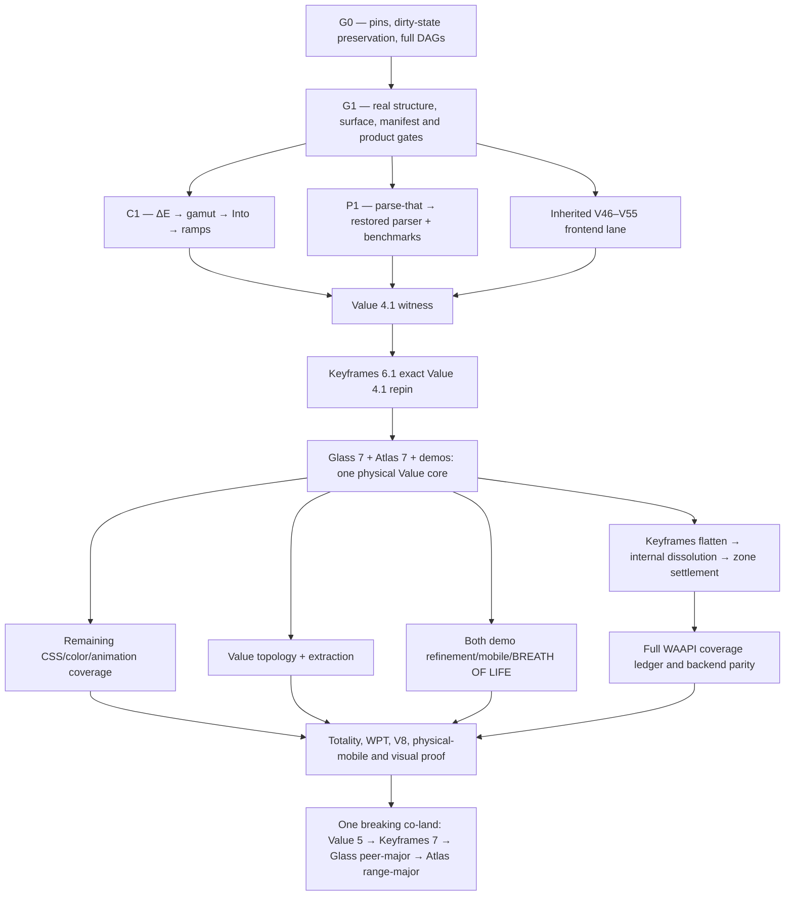

The formation has converged, but the tranche corpus could not be landed: this workspace is mounted read-only, and the write attempt was rejected. No source, documentation, browser state, or existing user work was changed.

## Converged tranche: W

The sole seed remains the [refined kickoff](/Users/mkbabb/Programming/value.js/docs/tranches/V/coordination/keyframes-inbox-2026-07-18-vnext-ingestion-prompt.md) and [P0–P6 handoff](/Users/mkbabb/Programming/value.js/docs/tranches/V/coordination/keyframes-inbox-2026-07-18-vnext-formation-handoff.md). The quarantined r1 corpus was never loaded. Two Sol skeptics and a third Sol adjudicator returned clean after modifications; no Luna participated in formation.

The selected architecture is release-stratified:



The intended corpus under `docs/tranches/W/` is fully specified as:

- Authority: `W.md`, `PROMPT-RECAP.md`, `RETURN.md`
- Truth: `PIN-LEDGER.json`, `DAG.md`, generated runtime/type/full graph manifests
- Decisions: `RESTORE-LEDGER.md`, `SPEC-COVERAGE.md`, `DISPOSITIONS.md`, `OWNER-DECISIONS.md`
- Execution: `CARRY-LEDGER.md`, `EVIDENCE.md`, `PROGRESS.md`, standalone `waves/*.md`
- Formation: `FORMATION-REGISTRY.md`, `CONVERGENCE.md`
- Coordination: inbox plus Value→Keyframes foundation, publish, and co-land letters; post-parser PT-E amendment

## Settled technical program

Value 4.1 restores R-DELTAE through R-RAMP: ΔE OK/2000/ITP, analytical gamut mapping, the extended caller-owned `Into` family, parse-that parsing, and ramp sampling. Its seven v4 subpaths remain frozen.

Keyframes 6.1 then exact-pins Value 4.1, consumes those capabilities, deletes its local ΔE/ramp scars, and preserves both package subpaths and its 44-key engine mirror. Glass 7 and Atlas 7 require lock/test repinning only; their current peer ranges already admit the witness tuple.

The final major program settles:

- Value: typed `color-mix()`, relative colors, `contrast-color()`, OKHSL/OKHSV, HDR syntax, `spring()` grammar, animation/keyframe/timeline parsing, gradients and relevant CSS Values syntax.
- Keyframes: full WAAPI backend parity plus an implement/feature-detect/refuse row for every applicable Level 1 and Level 2 member.
- No public static CSS evaluator: context-dependent expressions remain typed and round-trippable without pretending to be a browser cascade.
- `spring()` grammar belongs to Value; solving belongs to Keyframes.
- SoA remains benchmark-triggered; boundary samplers remain W53-evidence-triggered.
- Public bounce half-curves are tombstoned as API sand.

The standards matrix is pinned to the current official drafts for [CSS Color 5](https://drafts.csswg.org/css-color-5/), [CSS Color HDR](https://drafts.csswg.org/css-color-hdr-1/), [CSS Values 5](https://drafts.csswg.org/css-values-5/), [CSS Images 4](https://drafts.csswg.org/css-images-4/), [Easing 2](https://drafts.csswg.org/css-easing-2/), [CSS Animations 2](https://drafts.csswg.org/css-animations-2/), [Web Animations 2](https://drafts.csswg.org/web-animations-2/), and [Scroll-driven Animations](https://drafts.csswg.org/scroll-animations-1/). “Full CSS coverage” is defined honestly as full typed coverage of Value’s color/value/gradient/easing/animation/keyframe/timeline boundary—not selectors, cascade, or layout.

Keyframes zone verdicts are now terminal:

- Keep: DrawSVG, scroll, ingest.
- Agglomerate: FLIP plus physics/morph into one layout-transition domain.
- Prune: split-text, the convenience MotionPath wrapper, and Oscillator.
- Preserve the generic engine’s ability to animate `offset-*`; only the redundant wrapper is removed.

## Topology verdict

Current graph evidence:

- Value library: 26 modules, 44 internal edges, zero cycles.
- Value demo: 247 production modules, 650 edges, four real cycle families.
- Value API: 83 production modules, 249 edges, zero cycles.
- Keyframes library: 153 modules, 627 internal edges, zero runtime cycles and four type-layer rings.
- Keyframes demo: one runtime SCC in orbital drag.

Keyframes flattening is exactly `src/animation/** → src/**`, proven by normalized pre/post graph equality. Pruning, public changes, `internal/` dissolution, and demo moves are separate clusters.

The two demos share architectural laws, not directory shapes. Keyframes remains scene/instrument/transport-oriented; Value remains Bench/picker/palette/workbench-oriented. Shared modules require two independent domain consumers, barrels remain pure, self-barrel imports are forbidden, grouped filenames lose redundant module prefixes, and tests live in external isomorphic trees.

The recent Claude-Code checkout is preserved, not canonicalized: `/Users/mkbabb/Programming/keyframes.js` contains 348 dirty paths. Its pre-stage snapshot accounts for the transaction. A K0 salvage manifest must classify the 104 non-identical/missing rows; reset or cleanup is forbidden without explicit owner authority.

## Mobile and BREATH OF LIFE

Value’s Optical Bench is preserved and refined, not redesigned. Pure topology work requires rendered DELTA=0; visual fixes require named masks and measured defects.

The mobile tools bar is now a born-RED shell defect. Every primary tool must remain reachable, active state visible, safe-area aware, keyboard-viewport safe, and operable at 200% zoom.

WatercolorDot remains decorative Glass paint:

```text
native Value-owned button/trigger/readout
└── aria-hidden, pointerless WatercolorDot
```

All current `tag`, click, disabled, and ARIA misuse on the dot must disappear. Dots may sit behind slider readouts, never replace Slider thumbs or input geometry. Glass owns deterministic paint and optional one-shot birth rendering; Value owns when birth happens and all semantic hover/focus/press/value-change choreography. No per-value turbulence reseeding and no idle rAF.

Keyframes mobile receives:

- One scroll owner, safe-area-aware bounded sheets, accessible compact scene selection, 44px controls, and lazy-mounted Monaco.
- A private pointer-flight kernel owning pointer IDs, capture, cancellation and two-pointer geometry only.
- Cube-local quaternion mapping: one-finger orbit; two-finger pan, logarithmic pinch, and shortest-angle twist; seamless 1→2→1 transitions; no hot-path allocation.
- One final Pointer Events path. Touch/Gesture rails are removed only after physical iPhone/iPad Safari and macOS Safari evidence; failure blocks release rather than preserving dual paths.
- Meaningful touch, mouse/pen and keyboard parity for Cube, Amiga, Square, Easing, Spring and Sequence.
- Reduced motion preserves direct manipulation while eliminating glide, overshoot and moving specular effects.

## Parse-that verdict

Published parse-that 1.0 is fit for Value’s restoration boundary: 124/124 tests and its full proof suite passed, with all historical Value symbols and subpaths present. No parse-that uplift blocks R-PARSER.

After restoration, one PT-E amendment carries actual diagnostic/type-inference consumer anchors. Tape, substrates, Pratt, Rust regex work and bbnf restart remain routed to their own tranche set.

## Remaining owner-only decisions

Only four decisions remain genuinely subjective or destructive:

- Supported Safari floor/device pair.
- Final visual blessing and WatercolorDot birth amplitude/tempo.
- Extracted palette API destination, history and deployment ownership.
- Final disposition of the preserved dirty Keyframes checkout.

Persistence is the sole immediate blocker. Re-run this task with write access to `/Users/mkbabb/Programming/value.js`; the converged corpus can then be materialized and verified without repeating the audit.
The mega-tranche is fully formed and adversarially converged, but workspace persistence is blocked by the active Codex sandbox.

- 156 direct waves: `P 8 + V 33 + K 25 + A 32 + G 7 + D 28 + M 12 + C 11`.
- Passes 10 and 11 were consecutively clean under two hostile Sol-role critics and Luna-role adjudication.
- No production implementation began.
- Both seed letters were honored; the quarantined r1 corpus was never loaded.
- All 14 value routes and 7 keyframes routes were audited across desktop, tablet, mobile, and compact layouts.
- The Claude Code JSONL history—not merely its workspace—was audited.

Binding results include:

- One production CSS spine in value.js; BBNF is an independent executable witness.
- Full pinned [CSS Snapshot 2026](https://drafts.csswg.org/css-2026/) and [Webref](https://w3c.github.io/webref/) inventory with explicit typed, contextual, delegated, preserved, or refused status.
- Normative [CSS Color 4](https://drafts.csswg.org/css-color-4/) local-MINDE gamut mapping; cusp/Halley only as an optional fast policy.
- parse-that limited to 1.1, with whole-CSS prototypes preceding the canonical isolated run context and module transpose.
- Complete value/keyframes target DAGs, external isomorphic tests, clean package direction, and terminal keyframes facility dispositions.
- Palette API retained inside value.js `/api`, with immutable IDs/revisions, complete CRUD/history/forks/variants/mixing/tags/names/votes/flags, secure sessions, and Fourier protocol isomorphism.
- Separate palette content, CAS, social, moderation, and audit histories.
- Versioned typed URL state and sharing for both demos.
- Total app-level shadcn abrogation, direct glass-ui/Tailwind v4 use, and named missing glass primitives.
- Optical Instrumentarium and Chronographic Stage design programs, including the mobile toolbar repair, bounded keyframes inspector, lazy Monaco teardown, and quaternion multi-pointer input.
- Atmosphere is settled as a compact environmental-palette instrument; no generic slider wall. Keyframes authoring remains within Sequence, not a new route.

The intended artifact root is:

`/Users/mkbabb/Programming/value.js/docs/tranches/V/vnext/`

It was to contain the charter, provenance, current/target DAGs and trees, standards matrix, parser/color/keyframes/API/design programs, dispositions, formation record, return contract, wave books, and cross-repository coordination letters.

The first `apply_patch` was rejected verbatim:

```text
patch rejected: writing is blocked by read-only sandbox; rejected by user approval settings
```

Your authorization is clear, but it cannot override the enforced filesystem profile. Please continue this task in a writable workspace; the converged 156-wave registry can then be persisted without repeating formation or beginning tranche execution.
The mega-tranche formation is analytically complete but not persisted.

- 156 fully specified waves: P 8, V 33, K 25, A 32, G 7, D 28, M 12, C 11.
- Every wave has dependencies, born-RED evidence, deliverables, falsifiable gates, exclusions, and return contract.
- Passes 10 and 11 were consecutive clean hostile-review passes.
- Parser/CSS/color, keyframes/WAAPI, palette/Fourier CRUD, DAGs, URL state, shadcn abrogation, every-route responsive design, Breath of Life, consumers, and coordinated release are covered.
- No production execution began and no existing user work changed.

The write-ready corpus comprises 16 documents, including four wave books, formation/provenance/DAG records, design and parser programs, binding dispositions, and routed handoffs.

Persistence to `/Users/mkbabb/Programming/value.js/docs/tranches/V/vnext/` is the sole remaining step. The filesystem rejected the write with: `writing is blocked by read-only sandbox`. The workspace must be reopened writable to land the corpus; the goal remains active, not marked complete.
The goal is now marked blocked after the third consecutive read-only continuation.

Authoritative recheck:

- `docs/tranches/V/vnext/` does not exist.
- `docs/tranches/V/` is not writable.
- HEAD remains `c654824e0b25` on `tranche-u`.
- Existing user changes remain untouched.
- The 156-wave specification corpus is fully rendered but cannot be persisted.

Resume this task in a writable workspace to land the tranche documents; no production execution should begin yet.
Your authorization is clear, but the sandbox remains system-mounted read-only. The real `README.md` patch was rejected with:

`writing is blocked by read-only sandbox; rejected by user approval settings`

Please switch this task’s workspace access to writable/write-enabled, then say “continue.” I cannot override that mount from inside the task.
The permission change has not propagated. A second real patch attempt was again rejected by the read-only sandbox. The goal remains active; no files or user changes were touched.
The third resumed write attempt was rejected by the same read-only sandbox. I’ve marked the goal blocked again. The rendered 156-wave corpus remains preserved; no repository files were changed.
null
null
Not yet converged. We are close in tranche topology, but not in admissible proof.

I deployed three independent Agent v2/Sol-ultra audits—wave inventory, convergence integrity, and prompt coverage—followed by a fresh Sol-ultra adjudicator. The adjudicated status is:

| Measure | Current state |
|---|---:|
| Wave rows/contracts | 190/190 |
| Dependency edges | 759 |
| Seed requirements owned | 149/149 |
| Focused repairs RR-01–RR-13 | Closed |
| RR-14 hostile closure | 0/1 |
| Formation-wide clean passes | 0/2 |
| P01 parser authors | 0/2 |
| Production waves executed | 0/190 |

What is genuinely done:

- The full registry exists across P8, V44, K27, A36, G10, D33, M13 and C19.
- The graph validates at `e8942c…`; the 190 wave contracts validate at `123c9e…`.
- The seed bijection is exact: 140 folded, 3 banked, 6 retired, with no ownerless seed request.
- Current/target DAG authorities, module target paths, package boundaries, routing/state design, deletion procedures, shadcn abrogation, mobile interaction laws, visual matrices and named consumer migrations are formed.
- The API specification is unusually concrete: 130 HTTP and 17 headless operations with exact ownership and return coverage.
- RR-14’s lower-level execution helper passes 20 positive and 212 hostile cases.
- The current formation epoch contains 172 files and hashes to `f3f1d543…`.

What is not implemented:

- No value.js, keyframes.js, API, Glass, demo or consumer production wave has executed. The corpus explicitly records **0/190** at [README.md](/Users/mkbabb/Programming/value.js/docs/tranches/V/vnext/README.md:136).
- The parse-that CSS parser is specified but not authored. P01 remains `born_red`, with zero authors and pending adjudication at [P01-INDEPENDENT-AUTHORSHIP.json](/Users/mkbabb/Programming/value.js/docs/tranches/V/vnext/P01-INDEPENDENT-AUTHORSHIP.json:175).
- The existing CSS mirror is only the 15-module formation snapshot. The terminal BBNF full-union execution snapshot remains late-bound; coordination currently reports `snapshot_current:false` and upstream pin drift.
- Full CSS/WAAPI generated inventories, final DAG transposes and the consumer census are owned execution waves—not present-tense implemented artifacts.
- All 170 files under `docs/tranches/V/vnext/` remain untracked. Only the two seed letters are in Git history.

The adjudicator accepted six formation defects that must close:

1. `prompt_sha256` is required by the prompt/schema but omitted from the validator’s accepted attestation at [validate-clean-passes.mjs](/Users/mkbabb/Programming/value.js/docs/tranches/V/vnext/tools/validate-clean-passes.mjs:718).
2. The validator compares an encrypted provider carrier against plaintext at [validate-clean-passes.mjs](/Users/mkbabb/Programming/value.js/docs/tranches/V/vnext/tools/validate-clean-passes.mjs:388).
3. Coordinator custody uses timestamp windows instead of a continuous physical-line automaton, permitting report create/delete laundering.
4. The P/V pre-implementation critic order conflicts with the authoritative immutable-final-state challenge at [RETURN-CONTRACT.md](/Users/mkbabb/Programming/value.js/docs/tranches/V/vnext/RETURN-CONTRACT.md:378).
5. Named consumers have prose owners, but only five producer repositories are machine-mandatory in [CONSUMER-UNIVERSE-BOUNDS.json](/Users/mkbabb/Programming/value.js/docs/tranches/V/vnext/CONSUMER-UNIVERSE-BOUNDS.json:63).
6. D19–D24 admin pages lack explicit Breath effects or typed N/A ownership, despite the every-page design edict.

The purported V28/K08 animation collision was rejected: CSS trigger syntax and imperative WAAPI behavior are already correctly separated.

So the exact remaining formation path is:

1. Repair those six bounded defects and their hostile controls.
2. Run a fresh RR-14/reopening skeptic pair and third-Sol adjudication.
3. Persist the formation corpus and freeze a new epoch.
4. Earn whole-formation clean pass 1.
5. Earn whole-formation clean pass 2 on the unchanged epoch.
6. Validate the six reports and final manifest.

In precise terms: **one bounded repair cluster, one focused triad and two whole-corpus triads remain—assuming no new finding family appears.** Only then is tranche formation converged; production will still begin at 0/190.
# Hostile union-ingestion assay

Subject inspected: current `docs/tranches/V/vnext/` after the two letters were rowed `READ` at `coordination/INBOX.md:48-49`. The letters are not folded: V-next still declares exactly the two July 18 seeds as its complete authority (`README.md:9-12`; `FORMATION.md:7-10`) and no `AD-*`, `AM-*`, `ADD-*`, `KL-*`, or `D-*` row exists inside V-next.

Verdict totals across all 114 demanded rows:

| Status | Count |
|---|---:|
| Already satisfied | 17 |
| Partial | 29 |
| Missing | 20 |
| Contradicted | 48 |

Legend: `S` already satisfied; `P` partial/current owner exists but lacks the union law; `M` missing; `X` current formation specifies the opposite outcome.

Path abbreviations:

- `PV` = `docs/tranches/V/vnext/waves/P-V.md`
- `KA` = `docs/tranches/V/vnext/waves/K-A.md`
- `GD` = `docs/tranches/V/vnext/waves/G-D.md`
- `MC` = `docs/tranches/V/vnext/waves/M-C.md`
- `DISP` = `docs/tranches/V/vnext/DISPOSITIONS.md`
- `OA` = `docs/tranches/V/vnext/OWNER-AMENDMENTS.md`

## AD-1…AD-17

| Row | State | Minimal owner | Evidence / defect |
|---|---|---|---|
| AD-1 | S | D01/D02, M01/M02, A13 | `STATE-ROUTING.md:8-43,104-223` already supplies the bounded codec/share law. D-22 still needs layering. |
| AD-2 | S | A00/A01/A20/A23C/A26 | `API-OPERATIONS.md:9,65-78` has 130 HTTP + 17 headless operations and both services. |
| AD-3 | P | A00/A03 + owner docket | OA-05 correctly keeps `/api` in repo (`OA:17`; `KA:53`), but no named `P3.2 EXTRACT` retired-superseded tombstone exists. |
| AD-4 | S | A05/A06/A18/A19/A22S | The security, policy, administration, audit and Fourier authority split is explicit at `KA:55-56,70-71,76`. |
| AD-5 | S | D03A | Mount-independent capability descriptors and the zero-capability rule are exact at `GD:71`. |
| AD-6 | S | K12, M03/M05-M10 | Pointer/quaternion kernel and single-screen scene program exist at `KA:31`; `MC:22-30`. AM-22 sequencing remains absent. |
| AD-7 | S | G03/G06/G08/G09 | Gap primitives and identity law exist at `GD:52,55-57`; anti-template test at `DESIGN-PROGRAM.md:151-166`. |
| AD-8 | S | LIVE audit, D25, M11 | The 21-route before corpus exists; closure owners are `GD:96`, `MC:31`. |
| AD-9 | P | V00C/V29T, K00/K22T, D00A/M00 | Manifests/tools exist, but encode rulings now overturned: `VALUE-TARGET-PATHS.json:68,304-305`; `KEYFRAMES-TARGET-PATHS.json:50-97`. |
| AD-10 | P | V29T/K22T/D00/M00 | External isomorphic-test ownership exists (`PV:118`; `KA:42`; `GD:67`; `MC:30`), but the value-owned rule/checksum-pinned keyframes-copy law is absent and stylesheet sand remains. |
| AD-11 | S | Formation root | Seven cells, validator and 149-row bijection exist (`PV:62-63`; `README.md:24,79-83`). AM-27/28 are separate missing amendments. |
| AD-12 | S | Deletion shared law | Four-question law is exact at `OA:31-44` and executable deletion machinery exists. Its current target decisions are often wrong. |
| AD-13 | X | V24/V29T | Current V24 remains conditional KEEP/PRUNE (`PV:109`) and target retains `decompose.ts`; D-9 now mandates PRUNE. |
| AD-14 | S | C00/C05/C10 | Operational crater/rehearsal/cut core exists at `MC:38,50,55`; AM-19/D-2/D-3 must reshape it. |
| AD-15 | S | P04 | Exact unchanged-1.0.0/no-republish receipt exists at `PV:68`. |
| AD-16 | S | V03/V15/V16A/V18R/V20 | Gate substance exists at `PV:82,96,98,101,105`, although V15’s raytrace placement is wrong under AM-4. |
| AD-17 | S | Formation root | Honest `0/190`, `0/2`, failed-pass retention and pins are explicit at `README.md:139-144`; `FORMATION.md:231-252`. |

## AM-1…AM-30

| Row | State | Minimal owner | Evidence / defect |
|---|---|---|---|
| AM-1 | X | P00/P01/P05/V03 | P00/P01 wait on a terminal upstream CSS union (`PV:64-65`; `coordination/HANDOFFS.md:94-108`); `164343c1` and `css-parse-perf` are absent. This is the exact external-gate architecture KL-1 kills. |
| AM-2 | S | V01/V02/V29 | Standards lock, fact/support separation and operation-vector join are exact at `PV:80-81,117`. |
| AM-3 | P | V04-V29 | Domain decomposition exists, but V04 and much of the lane remain serially parser-blocked (`PV:83-95`) instead of default-IN execution stubs. |
| AM-4 | X | V15 | Current V15 makes Ray Trace an independent production challenger (`PV:96`); union requires Local-MINDE production and raytrace test-only. |
| AM-5 | X | V15P | Current wave explicitly retains a PRUNE arm (`PV:97`); union says restore as decided input. |
| AM-6 | X | V00R(new), V16A/V16B | SCI-1/D54/W56 and named hot paths are absent; mix/ramp Into remain hostage to V16B (`PV:98-101`). |
| AM-7 | X | V15P/V18H/V18V | Current H/V are separate terminal KEEP/PRUNE decisions (`PV:102-103`), not two clients of one kept cusp kernel. |
| AM-8 | P | V18R + P4.5 dispatch | Independent scalar oracle exists (`PV:101`); keyframes scar census/deletion and pin-advance dispatch do not. |
| AM-9 | X | V05/V19/V25 | HDR build exists (`PV:104`), but V05 implements static evaluation (`PV:84`) and V25 rejects CSS `spring()` (`PV:113`), opposite D-16/D-17. |
| AM-10 | X | K00/K22T | Current flatten program does not cite LT-10/LT-16/proof:structure and treats `internal` as a forbidden/deleted root (`DISP:47-48`; `KA:42`), contrary D-8’s named-module dissolution. |
| AM-11 | X | K09/K14/K15/K21/K22/K22T | Current K14/K15/K21/K22 prune, while K09 keeps ingest (`KA:28,33-34,40-42`); D-6/D-7 rule the inverse or narrower outcomes. |
| AM-12 | X | V00C/V29T | Current six-key freeze plus `./value` and root tombstones is explicit (`PV:79,118`; `DISP:31-37`); D-1 holds seven keys and forbids those changes. |
| AM-13 | P | V00B | V00B only removes value→keyframes/Glass edges (`PV:78`). It lacks the parse-that allowlist, self-dependency prior-art clause and 4.0.0 tombstone backfill. |
| AM-14 | X | A02/A21J | A02 unconditionally implements durable idempotency (`KA:52`); D-10 keeps the no-store record unless A21J later proves the named retrigger. |
| AM-15 | P | A08/D12 | Authenticated cursors exist (`KA:59`), but no named D3/D.W2 overturn or exact 400 contract exists; D12 currently says only “visibly recovers” (`GD:82`). |
| AM-16 | X | A09/A10/D10 | A09 and D10 implement restore (`KA:60`; `GD:80`); D-12 declines restore and keeps revision-revert. |
| AM-17 | X | A07T/D12F | Current A07T deletes tier wholly (`KA:58`; `DISP:97-98`); D-13 retains `(visibility,tier)` and extracts featured only. |
| AM-18 | P | A12/A13/D14 | Mixing and `/shares` are already deep (`KA:64-65`; `API-OPERATIONS.md:139-162`), but TA-4/trichotomy citation and consumer-inside-gate law are absent. |
| AM-19 | X | V00R(new), G07, C05/C10 | C10 schedules Glass 8 and has no 4.1.x/ERESOLVE entry gate (`MC:55`), opposite D-2/D-3. |
| AM-20 | M | P4.5 coordination owner | `coordination/HANDOFFS.md` acts as an authority/channel with direct packet programs (`:72-240`); there is no P4.5 sole dispatch discipline or car/ack ledger. |
| AM-21 | P | G00I(new), G09/M08 | Current M08 hardcodes geometry before a distinct measurement record (`MC:27`); D-21 requires the record first. |
| AM-22 | P | K12/M04-M10 | Kernel and traces exist, but no DAG proves five non-cube scenes before Cube; Cube directly consumes K12 (`MC:24`). |
| AM-23 | M | G00I(new) | G04/G05 depend only on G00 (`GD:53-54`); no W-ING bound-input predecessor exists. |
| AM-24 | P | G00I(new), D25/M11/C07 | Audit matrices are broad (`GD:96`; `MC:31,52`), but no shared probe rig/authed-admin/safe-area oracle precedes captures. |
| AM-25 | X | D01/D02/M01/M02 | UrlEnvelope exists, but `usePaneRouter` has zero occurrence. Current architecture never ratifies it as source-of-truth before codec work. |
| AM-26 | X | Formation root | Apparatus is the opposite of the diet: selected return/authorship/forensic files total 534,057 bytes; V-next has 88 top-level tools and 3,706,058 non-review bytes. Normative sprawl is visible at `README.md:41-60,98-119` and `RETURN-CONTRACT.md:379-442`. |
| AM-27 | M | Formation root | Seed inventory remains exactly 149 blocks from the two July 18 letters (`README.md:24-25`). No C1-C23/CARRY/V-PRIME/union recipient-existence join exists. |
| AM-28 | M | Formation root | Wave tables remain seven cells (`PV:62-63`, `KA:16-17`); no Routing/π eighth cell or PL-10/PL-11 law exists. |
| AM-29 | X | D00A/D00 vs M00/M10T | Keyframes overhaul is correctly large, but Value also mandates a wholesale target transpose (`GD:64,67`), not defect-driven moves under retained edge-law gates. |
| AM-30 | M | Union convergence root | Existing R4 judged only the pre-union corpus and is NOT CLEAN (`reviews/ROOT-REPAIR-R4-ADJUDICATION.md:13-30`). No frozen union epoch or union clean pass exists. |

## ADD-1…ADD-13

| Row | State | Minimal owner | Evidence / defect |
|---|---|---|---|
| ADD-1 | M | Existing D owners + V00R(new) | No CARRY-LEDGER/W46-W56 program occurs in V-next. Fold W47→D03A, W48→D06/G01, W49/50+D57→D08/D09/D14, W52→D19-D24, W53/W54→D17/D18, W55→D25, W56→V00R. |
| ADD-2 | P | V00A/V00B/V29T/V30 | Current baseline/capability-diff machinery exists (`PV:77-79,118-119`), but no v3.1.0↔4.0.0↔HEAD tri-tag ledger or retro-tombstones. |
| ADD-3 | M | D00A/D00/D25 | No explicit value e2e fleet ABROGATE/FOLD/KEEP-EARNED/journey disposition exists. |
| ADD-4 | P | G00I(new) | LIVE audit and C07 offer evidence/physical gates, but no shared isolated-profile, safe-area, multitouch and authenticated-admin probe-rig precondition exists. |
| ADD-5 | P | K00/K02/K04I/K09 + P4.5 | WAAPI destination and ingest owners exist (`KA:20,22,28`); easing consume-vs-ratify brief and eight-zone regex census do not. |
| ADD-6 | M | G00I(new) | BJ/IOS27 ingestion by numbered law is wholly absent. |
| ADD-7 | M | Formation root + K00/K22T | No W-GOV lineage annex, D50 row, record citation check or live-gate dispositions. |
| ADD-8 | M | G00I(new) | DesignSync is merely banked as unavailable (`reviews/X-ADJUDICATION.md:29`); no retrigger execution row exists. |
| ADD-9 | P | A01/A26 | Both API families are enumerated, but no first-class bidirectional facility-isomorphism contract or named refusal mapping exists. |
| ADD-10 | P | A00/A01/A03/A12/A21/A26 | Census, normative registry, external tests and structure pass largely exist (`KA:50-53,64,74,85`); the explicit oklab boundary cure and day-one ordering are absent. |
| ADD-11 | P | A21/A22S/A23/A23C | Current formation has accountless resource credentials, external tests and complete CRUD. Session/social pieces of the older ADD row conflict with the owner-ratified Codex A-band and should be marked superseded, not smuggled back (`KA:73-84`; `KEYFRAMES-API.md:458`). |
| ADD-12 | P | Shared wave grammar | Re-pin/model/phase concepts exist piecemeal, but no G-0 stamp, per-wave E13 opening sweep or `model_served` field exists. |
| ADD-13 | M | G00/G07 coordination | No two-batch Glass relay, early unblocker batch or F-PD-20/21 reconvergence home exists. |

## KL-1…KL-12

| Row | State | Minimal owner | Evidence / defect |
|---|---|---|---|
| KL-1 | X | P00/P01 | Current parser spine explicitly waits for upstream terminal closure (`PV:64-65`). |
| KL-2 | X | V15P | Current PRUNE arm remains (`PV:97`). |
| KL-3 | X | V15 | Ray Trace remains a production challenger (`PV:96`). |
| KL-4 | X | V16A/V16B | Mix/ramp Into remain deferred to V16B (`PV:98-101`). |
| KL-5 | X | P01 apparatus | Full-formation authorship police remain normative (`README.md:41-42`; associated validator stack), not a compact W0 pilot. |
| KL-6 | X | Formation root | Provider/bootstrap/custody/exec forensics remain normative (`README.md:113-119`). |
| KL-7 | P | C00U | RR-17 source projection is being repaired with the TS API, but the declared mandatory universe remains fifteen Git roots plus six subdirectories (`FORMATION.md:52-69`), not the union’s narrowed trusted core. |
| KL-8 | X | V00C/V29T | Six-key freeze is asserted as settled (`PV:79,118`). |
| KL-9 | X | K14/K15/K21/K22 | Zone flips are already encoded as terminal fiat (`KA:33-41`). |
| KL-10 | X | P01/V29T | Current law requires one grammar test mirror per runtime module and full CSS test projection (`PV:65,82,118`); stylesheet/token mirror sand has not been exempted. |
| KL-11 | X | Coordination/deletion law | HANDOFFS is treated as an authority channel and OA-14 as broad deletion authority (`coordination/HANDOFFS.md:72-240`; `OA:26`). |
| KL-12 | S | Existing executable manifests/G00 | V-next does not rely on prose-only targets or an empty Glass-gap claim, and it openly banked the DesignSync omission. |

## Repair ledger 1…20

| # | State | Minimal owner | Evidence / defect |
|---|---|---|---|
| 1 | P | RR-17 root | R4 sustained all six findings and remained NOT CLEAN (`ROOT-REPAIR-R4-ADJUDICATION.md:13-30`). Later repair work has no fresh union-era adjudication yet. |
| 2 | M | Formation root + K00/K22T | No LT-10/LT-16/proof:structure lineage or live-gate disposition annex. |
| 3 | M | Shared validator | No record-citation grep gate. |
| 4 | X | P00/P01/V03 | Historical restoration baseline and no-wait parser spine absent; current external gate remains. |
| 5 | M | P01 | Prototype is still born RED/zero authored bytes; no C14 pilot output. |
| 6 | M | P05 | No resurrected historical CSS benchmark or one-time regex baseline. |
| 7 | P | V00C/V29T | D-1 now exists externally, but current waves still carry the opposite six-key outcome. |
| 8 | X | K09/K14/K15/K21/K22 | External D-6/D-7 rulings are not folded; every key terminal except scroll currently disagrees. |
| 9 | X | A02/A08/A09/A07T | Current API waves retain all four silent/incorrect outcomes. |
| 10 | X | V00R(new), V16A/V16B | SCI-1/D54/W56 and unconditional mix/ramp Into absent. |
| 11 | X | V15/V15P/V18H/V18V | Production raytrace and prune-eligible cusp/H/V remain. |
| 12 | M | P4.5 | No keyframes dispatch car/ack packet. |
| 13 | M | D owners + V00R | No CARRY universe. |
| 14 | X | Formation root | Apparatus remains multi-megabyte and normative. |
| 15 | M | G00I(new) | No bound BJ/IOS27 input. |
| 16 | X | V05/V19/V25 | HDR agrees, but evaluator and spring rulings remain opposite. |
| 17 | X | V00R/G07/C05/C10 | Current boundary publishes Glass 8 and lacks 4.1/ERESOLVE entry proof. |
| 18 | P | V00B | Dependency removal exists, but allowlist/self-dep/tombstone contract does not. |
| 19 | M | Formation root | Union canon and recipient-existence extension absent. |
| 20 | M | C01/C02, D/G owners, shared grammar | Atlas chase, dual-homed C2, D50, PNG, pin-currency and G-0 completion rows absent. |

## D-1…D-22

| Row | State | Minimal owner | Evidence / defect |
|---|---|---|---|
| D-1 | X | V00C/V29T/C10 | Six-key + `./value`/root tombstones remain (`PV:79,118`). |
| D-2 | X | G07/C10 | C10 explicitly publishes Glass 8 (`MC:55`); G07 peers also assume the Glass-8 cut (`GD:58`). |
| D-3 | X | V00R(new), C05/C10 | No 4.1.x predecessor or two-leg ERESOLVE entry gate. |
| D-4 | X | Formation root | Current contract funds content attestation/provider bootstrap/custody (`RETURN-CONTRACT.md:379-442`; `README.md:113-119`) instead of `model_served` plus spot probes. |
| D-5 | X | Formation root | All 32 seats require Sol (`FORMATION-SEAT-LEDGER.json:5-10`); mechanical audits were not routed to Luna under the owner’s Fable→Sol, Opus→Luna substitution. |
| D-6 | X | K14/K15/K21/K22 | Current results are FLIP PRUNE, wrapper PRUNE, physics PRUNE and catalog PRUNE (`KA:33-41`), not KEEP/TRIM/KEEP/SHRINK. |
| D-7 | X | K09/K22T/P4.5 | K09 currently KEEPs ingest (`KA:28`; `DISP:55`), while D-7 retires it. Scroll is already retained. |
| D-8 | X | K00/K22T | `internal` is currently deleted/forbidden (`DISP:47-48`; target manifest), not dissolved into named modules while extending proof:structure. |
| D-9 | X | V24/V29T | Decompose remains conditional and physically present in the target manifest. |
| D-10 | X | A02/A21J | Durable idempotency is unconditional (`KA:52`). |
| D-11 | P | A08/D12 | Cursor machinery exists, but exact 400 and named overturn are missing. |
| D-12 | X | A09/A10/D10 | Restore remains first-class. |
| D-13 | X | A07T/D12F | Tier is wholly deleted instead of retained outside featured membership. |
| D-14 | S | A13/D08/D14 | `/api/shares` is fully specified (`API-OPERATIONS.md:155-159`); keyframes remains local-only (`STATE-ROUTING.md:223`). |
| D-15 | P | A00/A01/A21-A26/C03/C04 | Full Fourier breadth is already present, but the bidirectional facility-isomorphism contract and D-10…D-13 reconciliation are absent. |
| D-16 | X | V25/K10 | V25 explicitly forbids CSS spring (`PV:113`); K10 correctly owns the solver (`KA:29`). |
| D-17 | P | V05/V19 | HDR builds (`PV:104`); static numeric evaluation remains (`PV:84`) contrary the retire ruling. |
| D-18 | P | V20 | WCAG/APCA policies exist (`PV:105`), but APCA is not explicitly experimental-flagged while WCAG21 is republished. |
| D-19 | S | V16B | Real-workload threshold and terminal bank/prune behavior are already exact (`PV:99`; `DISP:12`). |
| D-20 | P | G00I(new), D03/D03A | Capability registry exists (`GD:71`); dock-morph, W-ING predecessor and DesignSync choice gate do not. |
| D-21 | P | G00I(new), G09/M08/M02 | M02 already hard-cuts legacy decode (`MC:21`); easing geometry is prescribed before the required measurement record (`MC:27`). |
| D-22 | P | D01/D02 | UrlEnvelope exists, but `usePaneRouter` is not named or ratified anywhere. |

## Minimal integration design

The 190 count should not be defended as an invariant: it is embedded in schemas, tools and prose (`README.md:31,80,127-137`; `FORMATION.md:24-36,52-55`) and therefore currently incentivizes folds whether or not they are coherent. Nonetheless, the union does not justify dozens of new waves. Most findings are corrections to existing owners.

The Goldilocks result is **192 waves**, adding only two genuinely independent nodes:

1. `V00R — inherited SCI-1/W56 4.1.x vehicle`

   - After V00A/V00B.
   - Ships the already-decided Into minor without forking V16A.
   - Carries SCI-1/D54/W56, exact `mapColorToGamutInto`/`safeAccentColor` or historically ruled names, changelog/tombstones and consumer receipt.
   - Becomes a predecessor of V16A, G07’s Glass-7 peer move, and the C05 boundary-entry gate.
   - Keeps C10 the sole **breaking** cut, not the sole release of any kind.

2. `G00I — bound design-input and probe epoch`

   - After G00.
   - Owns W-ING, the F-PD-01 probe rig, DesignSync retrigger and the measurement record used by easing.
   - G04/G05/G09 and every D/M motion consumer depend on it.
   - This is preferable to bloating G00: selection/vendor cleanup need not wait on design capture, while every motion claim must.

Everything else should fold:

- W-GOV → shared formation law plus K00/K22T.
- Record-citation grep → shared wave validator, not a wave.
- Facility isomorphism → A01 artifact, verified by A26.
- Drop census → V00A; retro-tombstones/dependency law → V00B; closure → V30.
- E2E fleet adjudication → D00A dispositions, D00 moves/deletions, D25 journey truth.
- CARRY rows → existing D owners listed under ADD-1.
- Glass two-batch relay → G00/G07 coordination artifact, not a production wave.
- Keyframes boundary letter → P4.5 dispatch artifact owned by K00/K02/K04I/K09.
- Parser restoration, prototype and benchmark → P00/P01/P05/V03; no extra parser wave.

## Required semantic rewrites before any union clean pass

1. Append an immutable union-delta/owner-ruling ledger; preserve the 149-row historical seed inventory and add a second union inventory rather than rewriting it.
2. Extend the recipient-existence validator over both inventories.
3. Change the wave grammar to eight cells and add record citations.
4. Rewrite public-surface authority to D-1: seven keys, only quantize demotion, no `./value` or root removal.
5. Rewrite K09/K14/K15/K21/K22/K22T to D-6…D-8.
6. Rewrite V24 to unconditional PRUNE with tombstone.
7. Rewrite A02/A08/A09/A07T and the operation registry to D-10…D-13.
8. Add the A01 bidirectional value↔Fourier facility contract and retain first-class A21-A26 depth.
9. Rewrite V15/V15P/V16A/V16B/V18H/V18V/V18R to AM-4…AM-8 and D-19.
10. Rewrite V05/V19/V20/V25 to D-16…D-18.
11. Ratify `usePaneRouter` under UrlEnvelope and hard-cut old keyframes links.
12. Replace Glass 8 publication with the routed Glass 7.x peer-move receipt; put 4.1.x + executed ERESOLVE proof at boundary entry.
13. Rebase P00/P01 on the self-contained historical restoration/current extant BBNF-combinator mirror and make upstream evolution a PT-E coordination input, not the parser-spine gate.
14. Diet the apparatus before another corpus freeze:

   - keep one formation validator, one wave validator, target/API validators, deletion judgment and a deferred compact return validator;
   - demote old forensic files to evidence-only;
   - reduce P01 authorship proof to the W0 pilot;
   - replace provider bootstrap/custody/attestation machinery with per-seat `model_served` plus spot probes;
   - fold selftests behind `--selftest`.

R4/RR-17 work may be retained as focused repair evidence, but it cannot earn union convergence credit. The union corpus does not yet exist, so whole-union clean count remains necessarily zero.
